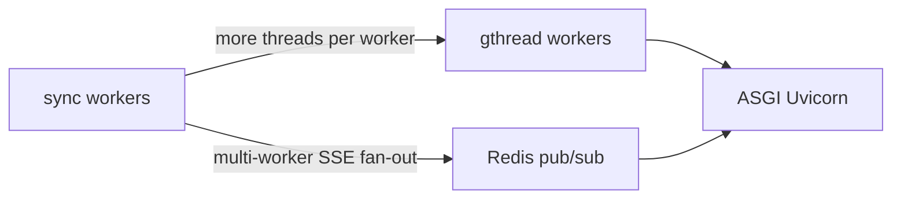

# ADR 0005: Gunicorn worker scaling and SSE transport evolution

## Status

Accepted (2026-07) · amended 2026-07 (phase 1.1)

## Context

Reception reservation version SSE (`GET /api/v1/reception/reservation-versions/stream/`) holds a Gunicorn **sync** worker open for the lifetime of the browser tab. Heartbeats every ~25 s keep the connection alive.

With **2 sync workers** and `--timeout 120`, two open SSE tabs could exhaust the worker pool. Remaining API requests (`/health`, `/sync-versions`, reservation detail) queued until timeout — observed in production (reservation #130 incident).

**Key lesson:** increasing Gunicorn workers mitigates API starvation but does **not** improve cross-process SSE event delivery.

Increasing workers is an **operational capacity fix** (phase 1). It does **not** fix in-process SSE fan-out: `publish_reservation_version_changed()` delivers events only to listeners on the **same worker** that handled the SSE connection. With *N* workers, push reliability is roughly *1/N* unless a shared bus is added.

Poll fallback (`useReservationVersionWatch` → `useTimelineVersionPoll`) keeps UI usable (~5 s delay) when push misses.

## Decision — phase 1 (2026-07)

1. **Configurable Gunicorn** via env vars (`GUNICORN_*`) and `scripts/run-gunicorn.sh` (not entrypoint).
2. **Default production profile:** 8 sync workers, `--timeout 3600` (long-lived SSE; not a normal HTTP timeout), `--max-requests 1000` + jitter, access log to stdout.
3. **Observability:** in-process SSE connection counters (**per worker process** — not global; reset on worker recycle/restart), structured `sse_stream_opened` / `sse_stream_closed` logs, `GET /api/v1/reception/system/status/` (**reception:read** — `schema_version: 1`, `metrics_scope`, `build.git_sha`, `build.started_at`, `build.hostname`).
4. **Load test gate:** `scripts/load-test-gunicorn-sse.sh` must PASS before sign-off after worker changes (`LOAD_TEST_LIGHT=1` for CI smoke).
5. **Benchmark:** `scripts/benchmark-health-latency.sh` — record p50/p95/p99 before and after changes (`BENCHMARK_LIGHT=1` for CI; artifacts via `OPS_CI_ARTIFACT_DIR`).
6. **Monitoring:** 3–7 day checklist in [gunicorn-sse-monitoring.md](../operations/gunicorn-sse-monitoring.md).

### Phase 1.1 SSE metrics (Prometheus-ready)

`get_sse_connection_stats()` exposes:

| Field | Purpose |
|-------|---------|
| `active_connections` | Current open SSE streams on this worker |
| `peak_connections` | High-water mark on this worker |
| `connections_opened_total` | Cumulative opens (counter) |
| `connections_closed_total` | Cumulative closes (counter) |
| `closed_streams_sample_count` | Streams included in average (equals closed count) |
| `average_duration_seconds` | Mean stream lifetime; **`null` until first close** |

**Reset behaviour:** counters are in-process only. Gunicorn `--max-requests` worker recycle or container restart resets all SSE counters to zero on that worker.

**Future (ASGI / Prometheus exporter):** `workers_total`, `workers_busy`, `workers_idle` — not available accurately with sync Gunicorn; add when moving to ASGI or a dedicated metrics sidecar.

## Worker class evolution



| Stage | Worker class | SSE push | When |
|-------|--------------|----------|------|
| **Now (phase 1)** | `sync` | In-process only; poll fallback | Capacity + observability |
| **Optional interim** | `gthread` | Still in-process per worker unless Redis | Need more concurrency without ASGI migration |
| **Phase 2a** | `sync` + **Redis pub/sub** | Reliable cross-worker | Measurable triggers below |
| **Phase 2b** | **ASGI (Uvicorn)** | Native long-lived connections | Long-term SSE/WebSocket platform |

**Not recommended:** `gevent` on Django ORM — transitional, less predictable than gthread or ASGI.

## Phase 2 trigger criteria (measurable)

Proceed to **Redis pub/sub** when **any** of these sustained over **3 consecutive business days** (or **any single day** for hard limits):

| Signal | Threshold | Source |
|--------|-----------|--------|
| `WORKER TIMEOUT` | **> 1 per day** | `docker compose logs django \| rg WORKER TIMEOUT` |
| Active SSE (aggregated) | **> 30** concurrent | Sum `sse.active_connections` across workers / logs |
| Health latency p95 | **> 500 ms** | `scripts/benchmark-health-latency.sh` or load-test benchmark |
| Health latency p95 under partial load | **> 200 ms** | Load test phase A (6 SSE) |
| SSE push miss rate | **> 25%** of version bumps not delivered within 2 s | Compare `touch` logs vs `reservation_version_changed` SSE events (multi-worker) |
| Operator-visible push delay | Panel updates **< 5 s** required but poll fallback insufficient | Support / ops feedback |

Proceed to **ASGI (Uvicorn)** when:

- Redis fan-out is stable for ≥ 14 days **and** WebSocket or native SSE scaling is on the roadmap, **or**
- `peak_connections` routinely exceeds `GUNICORN_WORKERS × 3` despite Redis.

## Phase 2 — `ReservationVersionEventBus` abstraction

Do **not** call Redis directly from `publish_reservation_version_changed()` or views. Introduce a small bus interface:

```python
class ReservationVersionEventBus(Protocol):
    def publish(self, reservation_id: int, scope: str, version: int, tenant_slug: str) -> None: ...

class InProcessEventBus:
    """Phase 1 — current in-process fan-out."""

class RedisEventBus:
    """Phase 2a — Redis pub/sub envelope."""
```

- **Factory** selects implementation from settings (`RESERVATION_VERSION_EVENT_BUS=in_process|redis`).
- `touch_reservation_version()` and SSE subscribers depend on the **protocol only**.
- Tests use `InProcessEventBus` or an in-memory fake; no Redis required in unit tests.

This keeps migration and rollback isolated to bus implementations.

## Redis event envelope (phase 2)

Do not publish raw Python dicts. Standard envelope on channel `stay:reservation_version:{tenant_slug}`:

```json
{
  "event_id": "550e8400-e29b-41d4-a716-446655440000",
  "type": "reservation_version_changed",
  "timestamp": "2026-07-08T11:00:00+02:00",
  "tenant_slug": "uzorita",
  "reservation_id": 130,
  "scope": "messages",
  "version": 17
}
```

**Required fields for consumers:**

- **`event_id`** — UUID v4 per publish; dedupe duplicates and retries.
- **`version`** — **required**, monotonic per `(reservation_id, scope)` (same integer as `ReservationVersion.version`). Subscribers may ignore:
  - **duplicate** — same `(reservation_id, scope, version)` or repeated `event_id`
  - **out-of-order** — `version` ≤ last seen for that scope
  - **stale** — `version` < current DB version on reconnect
- **`timestamp`** — ISO 8601 with timezone (publisher clock).

Each Gunicorn worker runs a Redis subscriber thread that forwards matching events into the local `event_queue` for connected SSE clients. Frontend contract (`connected`, `reservation_version_changed`) unchanged.

Implementation touch points:

- `ReservationVersionEventBus.publish()` — envelope to Redis.
- Worker boot — `RedisEventBus` subscriber → local fan-out in `reservation_version_events.py`.
- `touch_reservation_version()` — unchanged; calls bus via factory.

## Consequences

### Positive

- API remains responsive under many concurrent SSE tabs.
- Operators can tune workers without image rebuild (env-only).
- Metrics and logs make capacity decisions data-driven.
- Measurable phase 2 gates remove subjective “if problems persist” decisions.
- Event bus abstraction simplifies Redis rollout and testing.

### Negative

- More workers → lower in-process SSE push hit rate until Redis.
- Higher memory footprint (8 workers vs 2).
- `system/status` SSE counts are **per worker process** — sum across workers requires log aggregation or future Prometheus.

## References

- [reservation-versioning.md](../reservation-versioning.md) — SSE transport (v2)
- [gunicorn-sse-monitoring.md](../operations/gunicorn-sse-monitoring.md) — post-deploy checklist
- ADR [0001](0001-reservation-event-versioning.md) — versioning infrastructure
