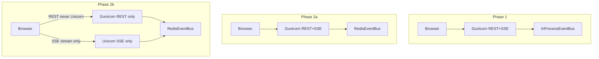

# ADR 0005: Gunicorn worker scaling and SSE transport evolution

> **This ADR intentionally separates event distribution from transport.**
>
> - **Redis** = event distribution across processes/instances
> - **Dedicated Uvicorn SSE service** = transport optimization for long-lived connections
> - **Full Django ASGI** = optional future (Phase 2c), not required for SSE scaling

## Status

Accepted (2026-07) · amended 2026-07 (roadmap refinement + operational tuning)

## Context

Reception reservation version SSE (`GET /api/v1/reception/reservation-versions/stream/`) holds a Gunicorn **sync** worker open for the lifetime of the browser tab. Heartbeats every ~25 s keep the connection alive.

With **2 sync workers** and `--timeout 120`, two open SSE tabs could exhaust the worker pool. Remaining API requests (`/health`, `/sync-versions`, reservation detail) queued until timeout — observed in production ([2026-07-08 SSE worker exhaustion incident](../../operations/incidents/2026-07-08-sse-worker-exhaustion.md), reservation #130).

**Key lesson:** increasing Gunicorn workers mitigates API starvation but does **not** improve cross-process SSE event delivery.

Increasing workers is an **operational capacity fix** (Phase 1). It does **not** fix in-process SSE fan-out: `publish_reservation_version_changed()` delivers events only to listeners on the **same worker** that handled the SSE connection. With *N* workers, push reliability is roughly *1/N* unless a shared bus is added.

Poll fallback (`useReservationVersionWatch` → `useTimelineVersionPoll`) keeps UI usable (~5 s delay) when push misses.

Worker exhaustion from long-lived SSE on Gunicorn sync workers is solved by **Phase 2b (dedicated Uvicorn SSE service)**, not by moving all of Django to ASGI without changing the event bus. ASGI is a **transport-layer optimization**, not the goal.

## Decision — Phase 1 (2026-07)

1. **Configurable Gunicorn** via env vars (`GUNICORN_*`) and `scripts/run-gunicorn.sh` (not entrypoint).
2. **Default production profile:** 8 sync workers, `--timeout 3600` (long-lived SSE; not a normal HTTP timeout), `--max-requests 1000` + jitter, access log to stdout.
3. **Observability:** in-process SSE connection counters (**per worker process** — not global; reset on worker recycle/restart), structured `sse_stream_opened` / `sse_stream_closed` logs, `GET /api/v1/reception/system/status/` (**reception:read** — `schema_version: 1`, `metrics_scope`, `build.git_sha`, `build.started_at`, `build.hostname`).
4. **Load test gate:** `scripts/load-test-gunicorn-sse.sh` must PASS before sign-off after worker changes (`LOAD_TEST_LIGHT=1` for CI smoke).
5. **Benchmark:** `scripts/benchmark-health-latency.sh` — record p50/p95/p99 before and after changes (`BENCHMARK_LIGHT=1` for CI; artifacts via `OPS_CI_ARTIFACT_DIR`).
6. **Monitoring:** 3–7 day checklist in [gunicorn-sse-monitoring.md](../../operations/gunicorn-sse-monitoring.md).

### Phase 1 operational tuning (2026-07-08 incident response)

Operational adjustments within Phase 1 — **not** a new architecture phase:

| Change | Value | Rationale |
|--------|-------|-----------|
| `GUNICORN_WORKERS` | **12** (was 8 at deploy; 2 at incident) | Capacity headroom under concurrent SSE |
| `GuestMessagesPanel` transport | **`"poll"`** | 1 SSE per reservation detail (timeline watch only), not 2 |
| `django-run` profile | No Traefik labels | One-off `manage.py` / tests without intermittent 502 |

Tuning reduces incident frequency but does **not** replace Phase 2.

### Phase 1.1 SSE metrics (Prometheus-ready) — historical amendment

`get_sse_connection_stats()` exposes:

| Field | Purpose |
|-------|---------|
| `active_connections` | Current open SSE streams on this worker |
| `peak_connections` | High-water mark on this worker |
| `connections_opened_total` | Cumulative opens (counter) |
| `connections_closed_total` | Cumulative closes (counter) |
| `closed_streams_sample_count` | Streams included in average (equals closed count) |
| `average_duration_seconds` | Mean stream lifetime; **`null` until first close** |

**Reset behaviour:** counters are in-process only. Gunicorn `--max-requests` worker recycle or container restart resets all SSE counters to zero on that worker.

**Future (ASGI / Prometheus exporter):** `workers_total`, `workers_busy`, `workers_idle` — not available accurately with sync Gunicorn; add when moving to dedicated Uvicorn SSE (Phase 2b) or a metrics sidecar.

## Phase model

```
Phase 1
  (capacity + observability)
  Operational tuning          ← not a new phase
       ↓
  Validation (3–7 days)
       ↓
  Incident closed
       ↓
Phase 2a
  (Redis EventBus)
       ↓
  Validation (14 days)
       ↓
Phase 2b
  (Dedicated Uvicorn SSE)
       ↓
  Validation (14 days)
       ↓
Phase 2c (optional)
  (Full Django ASGI)
```

### What each phase solves

| Phase | Solves | Does NOT solve |
|-------|--------|----------------|
| **Phase 1 + operational tuning** | Capacity headroom, observability, reduced SSE count | Cross-worker push; worker exhaustion at scale |
| **Phase 2a — Redis EventBus** | Event distribution across processes/instances; Celery → SSE; reliable push with multiple Gunicorn workers | Sync worker exhaustion from long-lived SSE on Gunicorn |
| **Validation (post-2a)** | Proves Redis introduced no regressions before touching transport | — |
| **Phase 2b — dedicated Uvicorn SSE** | Long-lived SSE no longer holds Gunicorn sync workers | Full-Django async benefits |
| **Phase 2c — full ASGI (optional)** | Whole-app async if ever justified | Required for SSE scaling |

## Target architecture



**Phase 2b invariant:** REST endpoints (admin, DRF API, `/health/`, `/sync-versions/`, etc.) are **never** routed to Uvicorn. Only `GET /api/v1/reception/reservation-versions/stream/` goes to the SSE service.

## Gate to start Phase 2a

Phase 2a architectural work starts only when **all** are true:

1. **Incident closed** — [postmortem](../../operations/incidents/2026-07-08-sse-worker-exhaustion.md) merged and ops sign-off
2. **Production validation complete** — Phase 1 runbook window (3–7 days) passed without regression
3. **ADR triggers justify architectural work** — measurable criteria below

Merge postmortem alone is **not** sufficient.

## Phase 2 trigger criteria (measurable)

Proceed to **Phase 2a (Redis EventBus)** when **any** of these sustained over **3 consecutive business days** (or **any single day** for hard limits):

| Signal | Threshold | Source |
|--------|-----------|--------|
| `WORKER TIMEOUT` | **> 1 per day** | `docker compose logs django \| rg WORKER TIMEOUT` |
| Active SSE (aggregated) | **> 30** concurrent | Sum `sse.active_connections` across workers / logs |
| Health latency p95 | **> 500 ms** | `scripts/benchmark-health-latency.sh` or load-test benchmark |
| Health latency p95 under partial load | **> 200 ms** | Load test phase A (6 SSE) |
| SSE push miss rate | **> 25%** of version bumps not delivered within 2 s | Compare `touch` logs vs `reservation_version_changed` SSE events (multi-worker) |
| Operator-visible push delay | Panel updates **< 5 s** required but poll fallback insufficient | Support / ops feedback |

Proceed to **Phase 2b (dedicated Uvicorn SSE)** when:

- Phase 2a Redis fan-out is stable for ≥ **14 days** (validation checklist passed), **and**
- `peak_connections` routinely exceeds `GUNICORN_WORKERS × 3` despite Redis, **or**
- Gunicorn worker pool still saturated by SSE under normal load

Proceed to **Phase 2c (full Django ASGI)** only when whole-app async is independently justified (WebSocket platform, etc.) — **not** required for SSE scaling.

## Feature flags

| Env | Values | Phase | Rollback |
|-----|--------|-------|----------|
| `RESERVATION_VERSION_EVENT_BUS` | `in_process` \| `redis` | 2a | Set `in_process`, recreate django/celery |
| `SSE_TRANSPORT` | `gunicorn` \| `uvicorn` | 2b | Set `gunicorn`; Traefik routes all API to `stay_django` |

Local/staging: `redis` + `gunicorn`. Production: `SSE_TRANSPORT=uvicorn` only after post-2a validation passes.

Comment stubs in `.env.example`; no `base.py` defaults until Phase 2a/2b code lands.

## `ReservationVersionEventBus` abstraction

Do **not** call Redis directly from `publish_reservation_version_changed()` or views. Introduce a small bus interface (full Protocol from day one; implementation deferred to future PR):

```python
class ReservationVersionEventBus(Protocol):
    def publish(
        self, reservation_id: int, scope: str, version: int, tenant_slug: str
    ) -> None: ...

    def subscribe(self, reservation_id: int, scope: str) -> queue.Queue: ...

    def unsubscribe(
        self, reservation_id: int, scope: str, event_queue: queue.Queue
    ) -> None: ...

    def is_available(self) -> bool:
        """True when bus is connected/ready; no exceptions for degraded state."""
        ...
```

Implementations:

- **`InProcessEventBus`** — wraps [`reservation_version_events.py`](../../../backend/apps/reservations/reservation_version_events.py); `is_available()` always `True`
- **`RedisEventBus`** — `is_available()` reflects Redis connection state (connected/disconnected) for ops/metrics without raising

- **Factory** selects implementation from settings (`RESERVATION_VERSION_EVENT_BUS=in_process|redis`).
- `touch_reservation_version()` and SSE subscribers depend on the **protocol only**.
- Tests use `InProcessEventBus` or an in-memory fake — no Redis in unit tests.

This keeps migration and rollback isolated to bus implementations.

## Redis channel + envelope (Phase 2a)

**Channel** (versioned for future envelope migrations):

```text
stay:v1:reservation_version:{tenant_slug}
```

**Envelope** (add `producer` for debugging):

```json
{
  "event_id": "550e8400-e29b-41d4-a716-446655440000",
  "type": "reservation_version_changed",
  "timestamp": "2026-07-08T11:00:00+02:00",
  "producer": "celery",
  "tenant_slug": "uzorita",
  "reservation_id": 130,
  "scope": "messages",
  "version": 17
}
```

`producer` examples: `django`, `celery`, `gunicorn`, `uvicorn` — identifies publish origin in logs/metrics.

**Required fields for consumers:**

- **`event_id`** — UUID v4 per publish; dedupe duplicates and retries.
- **`version`** — **required**, monotonic per `(reservation_id, scope)` (same integer as `ReservationVersion.version`). Subscribers may ignore:
  - **duplicate** — same `(reservation_id, scope, version)` or repeated `event_id`
  - **out-of-order** — `version` ≤ last seen for that scope
  - **stale** — `version` < current DB version on reconnect
- **`timestamp`** — ISO 8601 with timezone (publisher clock).

Each Gunicorn worker (Phase 2a) or Uvicorn SSE service (Phase 2b) runs a Redis subscriber that forwards matching events into the local `event_queue` for connected SSE clients. Frontend contract (`connected`, `reservation_version_changed`) unchanged.

Implementation touch points:

- `ReservationVersionEventBus.publish()` — envelope to Redis.
- Worker/service boot — `RedisEventBus` subscriber → local fan-out in `reservation_version_events.py`.
- `touch_reservation_version()` — unchanged; calls bus via factory.

## Validation checklists

### Post-Phase 1 (3–7 days)

See [gunicorn-sse-monitoring.md](../../operations/gunicorn-sse-monitoring.md).

### Post-Phase 2a (14 days)

- Push reliability (touch → SSE within 2 s)
- Celery-originated publishes delivered to SSE
- SSE reconnect rate (`sse_stream_opened`/`closed` ratio)
- Health latency p95
- **`redis_reconnect_count`** — if rising, problem is Redis connectivity, not SSE transport

### Post-Phase 2b (14 days)

- Gunicorn worker pool no longer saturated by SSE under normal load
- SSE active count on Uvicorn service vs Gunicorn REST health
- Rollback drill: `SSE_TRANSPORT=gunicorn` restores prior routing

## Worker class evolution (optional interim)

| Stage | Worker class | SSE push | When |
|-------|--------------|----------|------|
| **Phase 1** | `sync` | In-process only; poll fallback | Capacity + observability |
| **Optional interim** | `gthread` | Still in-process per worker unless Redis | More concurrency without ASGI migration |
| **Phase 2a** | `sync` + **Redis EventBus** | Reliable cross-worker | ADR triggers met + gate passed |
| **Phase 2b** | **Dedicated Uvicorn SSE** | Native long-lived connections on SSE service | Post-2a validation + transport saturation |
| **Phase 2c (optional)** | Full Django ASGI | Whole-app async | Independent justification |

**Not recommended:** `gevent` on Django ORM — transitional, less predictable than gthread or dedicated Uvicorn SSE.

## Consequences

### Positive

- API remains responsive under many concurrent SSE tabs (Phase 1 tuning; Phase 2b transport split).
- Operators can tune workers without image rebuild (env-only).
- Metrics and logs make capacity decisions data-driven.
- Measurable phase gates remove subjective “if problems persist” decisions.
- Event bus abstraction separates distribution (Redis) from transport (Gunicorn vs Uvicorn).
- Phase 2b avoids risky full-Django ASGI migration for SSE alone.

### Negative

- More workers → lower in-process SSE push hit rate until Redis (Phase 2a).
- Higher memory footprint (12 workers vs 2).
- `system/status` SSE counts are **per worker process** — sum across workers requires log aggregation or future Prometheus.
- Phase 2b adds a second service to operate (Uvicorn SSE + Traefik routing).

## References

- [2026-07-08 SSE worker exhaustion incident](../../operations/incidents/2026-07-08-sse-worker-exhaustion.md)
- [reservation-versioning.md](../reservation-versioning.md) — SSE transport (v2)
- [gunicorn-sse-monitoring.md](../../operations/gunicorn-sse-monitoring.md) — post-deploy checklist
- ADR [0001](0001-reservation-event-versioning.md) — versioning infrastructure
