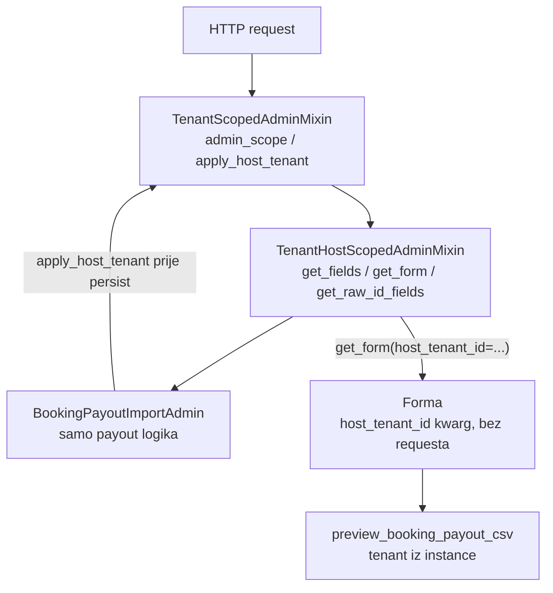

# Booking payout admin — TenantHostScopedAdminMixin

Plan za usklađivanje Django admina `BookingPayoutImport` s tenant-scoped arhitekturom.

## Kontekst

[`booking_payout_admin.py`](../../backend/apps/reservations/booking_payout_admin.py) danas duplicira tenant-host ponašanje koje bi trebalo biti generičko. Scope logika u [`admin_scope.py`](../../backend/apps/tenants/admin_scope.py) već postoji, ali admini je ne koriste dosljedno.

**Cilj:** jedan mixin kao autoritet; `BookingPayoutImportAdmin` ostaje fokusiran na CSV preview/persist/apply.



## Todo

- [x] `TenantScopedAdminMixin`: `admin_scope()`, `host_tenant_id()`, `is_host_scoped()`, `apply_host_tenant()` — autoritativno prepisivanje tenanta
- [x] Novi `TenantHostScopedAdminMixin`: `host_hidden_fields`, `get_fields`, `get_readonly_fields`, `get_raw_id_fields`, `get_form(host_tenant_id)`, FK dropdown filter
- [x] `BookingPayoutImportAdmin` nasljeđuje mixin; forma prima `host_tenant_id`; `save_model` poziva `apply_host_tenant`
- [x] Regresijski testovi: POST tampering, polja po hostu, widget tip, readonly change, staff cross-tenant POST

---

## 1. `TenantScopedAdminMixin` — scope API i enforce

Datoteka: [`backend/apps/core/admin.py`](../../backend/apps/core/admin.py)

Jedini ulaz u scope (nijedan admin ne zove `resolve_admin_scope()` direktno):

```python
def admin_scope(self, request) -> AdminScope:
    from apps.tenants.admin_scope import resolve_admin_scope
    return resolve_admin_scope(request)

def host_tenant_id(self, request) -> int | None:
    return self.admin_scope(request).tenant_id

def is_host_scoped(self, request) -> bool:
    return self.host_tenant_id(request) is not None
```

Javna metoda za postavljanje tenanta (jedini autoritet):

```python
def apply_host_tenant(self, request, obj) -> None:
    """Postavi tenant iz hosta; provjeri pristup. Poziva se prije validacije i spremanja."""
    if self.tenant_field == "tenant":
        host_tid = self.host_tenant_id(request)
        if host_tid is not None:
            obj.tenant_id = host_tid          # uvijek prepisuje, bez if not obj.tenant_id
        elif not getattr(obj, "tenant_id", None):
            allowed = self._allowed_tenant_ids(request) or []
            if len(allowed) == 1:
                obj.tenant_id = allowed[0]
    tenant_id = self._resolve_tenant_id_for_save(request, obj)
    if not user_has_tenant_access(request, tenant_id):
        raise PermissionDenied("Nemate pristup ovom tenantu.")
```

`_enforce_tenant_on_save` postaje tanak wrapper oko `apply_host_tenant`. `save_model` u baznom mixinu:

```python
def save_model(self, request, obj, form, change):
    self.apply_host_tenant(request, obj)
    super().save_model(request, obj, form, change)
```

**FK filter:** u `formfield_for_foreignkey` dodati `property_obj` uz postojeći `property`.

---

## 2. Novi `TenantHostScopedAdminMixin`

Datoteka: [`backend/apps/core/admin.py`](../../backend/apps/core/admin.py)

Nasljeđuje `TenantScopedAdminMixin`. Opt-in class atributi:

```python
class TenantHostScopedAdminMixin(TenantScopedAdminMixin):
    host_hidden_fields: tuple[str, ...] = ("tenant",)
    host_readonly_fields: tuple[str, ...] = ("tenant",)
    host_dropdown_fk_fields: tuple[str, ...] = ("property", "property_obj")
    platform_raw_id_fields: tuple[str, ...] = ("tenant",)
```

### Generičko skrivanje polja — `get_fields`

```python
def get_fields(self, request, obj=None):
    fields = list(super().get_fields(request, obj))
    if obj is None and self.is_host_scoped(request):
        fields = [f for f in fields if f not in self.host_hidden_fields]
    return fields
```

### Readonly tenant na change — `get_readonly_fields`

| View | Tenant |
|------|--------|
| Add + tenant host | skriven |
| Add + platform | editable (raw id) |
| Change | readonly |

### `get_raw_id_fields` — isključivo metoda

`property_obj` nikad nije raw id. `BookingPayoutImportAdmin.platform_raw_id_fields = ("tenant", "uploaded_by", "applied_by")`.

### `get_form()` — tenant prije validacije

Forma prima samo `host_tenant_id: int | None`, ne `request`. Bazna klasa u [`backend/apps/core/admin_forms.py`](../../backend/apps/core/admin_forms.py):

```python
class TenantHostScopedModelForm(forms.ModelForm):
    def __init__(self, *args, host_tenant_id=None, **kwargs):
        super().__init__(*args, **kwargs)
        if host_tenant_id is not None and not self.instance.pk:
            self.instance.tenant_id = host_tenant_id
        if host_tenant_id is not None and "tenant" in self.fields:
            del self.fields["tenant"]
```

---

## 3. `BookingPayoutImportAdmin` — samo payout logika

Datoteka: [`backend/apps/reservations/booking_payout_admin.py`](../../backend/apps/reservations/booking_payout_admin.py)

```python
class BookingPayoutImportAdmin(TenantHostScopedAdminMixin, admin.ModelAdmin):
    platform_raw_id_fields = ("tenant", "uploaded_by", "applied_by")
```

Ukloniti: statički `raw_id_fields`, lokalni `formfield_for_foreignkey` za `property_obj`.

### Forma

`BookingPayoutImportAdminForm(TenantHostScopedModelForm)` — u `clean()` koristi `self.instance.tenant`, bez HTTP konteksta.

### `save_model`

```python
def save_model(self, request, obj, form, change):
    self.apply_host_tenant(request, obj)
    if change:
        super().save_model(request, obj, form, change)
        return
    # payout-specifičan custom persist (preview_booking_payout_csv)
```

---

## 4. Pravilo za cijeli projekt

- `raw_id_fields` atribut → zabranjen u novim adminima; koristiti `platform_raw_id_fields` + `get_raw_id_fields()`
- FK s desecima zapisa → dropdown (`host_dropdown_fk_fields`)
- `raw_id` samo za tablice s tisućama zapisa

Ostali admini se **ne migriraju** u ovom PR-u.

---

## 5. Testovi

### Mixin unit testovi

Datoteka: [`backend/apps/tenants/tests/test_admin_tenant_scope.py`](../../backend/apps/tenants/tests/test_admin_tenant_scope.py)

- `apply_host_tenant`: superuser na tenant hostu s `obj.tenant_id = tenant_b` → postaje `tenant_a`
- `get_fields`: tenant skriven na add + tenant host
- `get_readonly_fields`: tenant readonly na change

### Booking payout integracija

Novi file: [`backend/apps/reservations/tests/test_booking_payout_admin_tenant_scope.py`](../../backend/apps/reservations/tests/test_booking_payout_admin_tenant_scope.py)

| Test | Assert |
|------|--------|
| POST tampering (superuser, tenant host) | `tenant_id` = host tenant, ne POST vrijednost |
| Add forma tenant host | HTML nema `name="tenant"` |
| Add forma platform host | HTML ima `name="tenant"` |
| Property widget | `<select name="property_obj">` |
| Change view | tenant readonly |
| Staff cross-tenant POST | 403 / nema importa za tuđi tenant |

---

## Datoteke

| Datoteka | Promjena |
|----------|----------|
| `backend/apps/core/admin.py` | Scope API, `apply_host_tenant`, `TenantHostScopedAdminMixin` |
| `backend/apps/core/admin_forms.py` | `TenantHostScopedModelForm` (novi) |
| `backend/apps/reservations/booking_payout_admin.py` | Nasljeđuje mixin |
| `backend/apps/reservations/tests/test_booking_payout_admin_tenant_scope.py` | Integracijski testovi |
| `backend/apps/tenants/tests/test_admin_tenant_scope.py` | Mixin unit testovi |

---

## Deploy / verifikacija

```bash
docker compose build django
./scripts/run-tests-postgis.sh \
  apps.tenants.tests.test_admin_tenant_scope \
  apps.reservations.tests.test_booking_payout_admin_tenant_scope \
  -v 2
docker compose up -d django
```

Ručno: `https://booking.uzorita.hr/admin/reservations/bookingpayoutimport/add/`

---

## Što namjerno ne radimo

- Migracija svih postojećih admina
- Refaktor `preview_booking_payout_csv` na DTO (follow-up)
- `super().save_model()` na add pathu (custom persist)

## Follow-up

- Migrirati `ReservationAdmin`, `IntegrationConfigAdmin`
- `preview_booking_payout_csv(content, import_obj: BookingPayoutImport, persist=...)`
