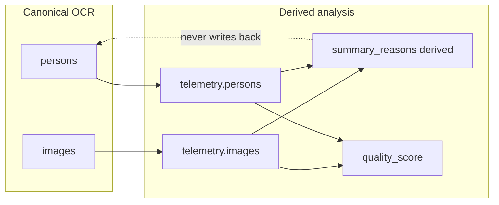

# Document intake telemetry (OCR-D)

Write-only observability for batch OCR jobs. KPIs come from `DocumentIntakeJob.ocr_result._telemetry`, not log grep.

**Reference:** OCR-D (this document). Do not confuse with integrations PR-D in [integrations-test-triage.md](integrations-test-triage.md).

**Related:** [ocr-multi-guest-rules.md](../operations/ocr-multi-guest-rules.md) (pipeline rules), [id-document-import.md](id-document-import.md).

---

## Architectural principles

1. **Tenant invariant is frozen** — no OCR PR may change `DocumentIntakeContext` / tenant guards except for deliberate architecture changes. See [AGENTS.md](../../AGENTS.md#document-intake--tenant-invariant) and [ocr-multi-guest-rules.md](../operations/ocr-multi-guest-rules.md#cross-tenant-invariant-waba--property-tenant).
2. **Observability before behavior** — pipeline decisions must not consume `quality_score` or failure reasons until a dashboard baseline exists (weeks of production data).
3. **Structured data over logs** — OCR KPIs come from `_telemetry`, not `grep`.
4. **Version everything** — `schema_version`, `quality_model`, and `pipeline_version` on every telemetry blob so trends stay comparable across algorithm and pipeline changes.
5. **`_telemetry` is append-only analysis** (see below).

---

## Append-only `_telemetry` contract

```
ocr_result = {
  "persons": [...],      # canonical OCR output
  "images": [...],       # canonical OCR output
  "_preprocess": {...},  # pipeline metadata (existing)
  "_telemetry": {...},   # analysis of the above — NOT canonical
}
```

| Rule | Detail |
|------|--------|
| OCR fields are source of truth | `persons[]`, `images[]`, matches, apply logic read only canonical OCR data. |
| `_telemetry` is derived | Computed from OCR result + image bytes + reservation context; never fed back into OCR, matching, or apply. |
| Never reconstruct OCR from telemetry | No code path may use telemetry to rewrite `persons`/`images`. |
| Re-process | Telemetry is recomputed via `attach_document_intake_telemetry()`, which **preserves unknown keys** already in prior `_telemetry`. |
| `computed_at` is metadata only | Excluded from score/reason computation so reproducibility holds. |



---

## Version bump policy

| Field | When to bump |
|-------|----------------|
| `schema_version` (int) | JSON shape of `_telemetry` changes (new top-level keys, renamed fields). |
| `quality_model` (str) | Scoring weights or reason heuristics change (e.g. `ocr-quality-v1` → `ocr-quality-v2`). Raw inputs in `quality_components` allow re-scoring historical jobs. |
| `pipeline_version` (str) | OCR pipeline code changes: prompt, parser, MRZ fixup, LLM path (e.g. `document-intake-v1`). |

Constants live in `backend/apps/reservations/document_intake_telemetry.py`.

---

## `_telemetry` schema

| Field | Purpose |
|-------|---------|
| `schema_version` | Integer; bump when JSON shape changes |
| `quality_model` | e.g. `"ocr-quality-v1"` |
| `pipeline_version` | e.g. `"document-intake-v1"` |
| `computed_at` | ISO timestamp; **not used in score/reason math** |
| `quality_score` | 0–100 job-level composite (write-only) |
| `quality_components` | Nested objects with `score` + raw inputs |
| `summary_reasons` | **Derived only** — union of `images[].reasons` + `persons[].reasons` + job-level reasons, deduped + sorted |
| `images[]` | `{index, reasons[], signals{...}}` — primary reason source |
| `persons[]` | `{person_index, reasons[], ...}` — primary reason source |
| `job_metrics` | `{auto_apply_count, match_count, unknown_person_count, ocr_under_extracted, orphan_pass_ran}` |

### `summary_reasons` derivation

Never primary — always derived:

```python
all_reasons = job_reasons
for item in images_telemetry:
    all_reasons.extend(item["reasons"])
for item in persons_telemetry:
    all_reasons.extend(item["reasons"])
summary_reasons = sorted(set(all_reasons))
```

### `quality_components` raw fields

Example (v1):

```json
"quality_components": {
  "resolution": {
    "score": 75,
    "min_edge_px": 600,
    "image_count": 4,
    "below_threshold_count": 1,
    "threshold_px": 800
  },
  "mrz_coverage": {
    "score": 50,
    "id_side_count": 4,
    "with_mrz_count": 2
  },
  "pairing": {
    "score": 75,
    "unassigned_count": 1,
    "image_count": 4
  },
  "names": {
    "score": 50,
    "person_count": 2,
    "named_count": 1
  },
  "completeness": {
    "score": 0,
    "is_complete": false,
    "ocr_under_extracted": true
  }
}
```

Raw fields are retained so a future `ocr-quality-v2` can re-score historical jobs without re-OCR.

### Quality score v1 weights

| Component | Weight |
|-----------|--------|
| resolution | 15% |
| mrz_coverage | 25% |
| pairing | 20% |
| names | 25% |
| completeness | 15% |

**Explicit rule:** no function returns reject / needs_review actions — only data.

---

## Failure reasons API

Stable enum: `OCRFailureReason` in `document_intake_failure_reasons.py`.

| Semantics | Meaning |
|-----------|---------|
| **Emitted (OCR-D)** | Reasons currently detected and written to `_telemetry`. |
| **Reserved** | Enum slot exists for stable API / future PR; not emitted yet (e.g. `image_blurry` → OCR-E). |
| **Deprecated** | Was emitted, no longer used (none in OCR-D). |

Helper: `reason_label(reason, lang="hr")` for future operator UI.

---

## Score reproducibility

Same inputs → identical `quality_score`, `quality_components.*.score`, and `summary_reasons`:

- No `timezone.now()` / `computed_at` inside score functions.
- No tenant_id, reservation_id, or job_id in score math.
- Iterate persons/images in sorted index order.
- Use `sorted(set(...))` for reason dedup.
- Integer rounding: explicit `round()` once per component and once for composite.

---

## Runtime code map (this PR)

| Module | Role |
|--------|------|
| `document_intake_failure_reasons.py` | Stable reason enum + labels |
| `document_intake_telemetry.py` | Build and attach `_telemetry` on OCR result (write-only) |
| `document_intake_service.py` | Pipeline hook after OCR / matching |

Tests:

```bash
./scripts/run-tests-postgis.sh apps.reservations.tests.test_document_intake_telemetry -v 2
```

Operational KPI reporting (CLI, Celery email, snapshot persistence) is documented in a follow-up OCR-D ops PR.
