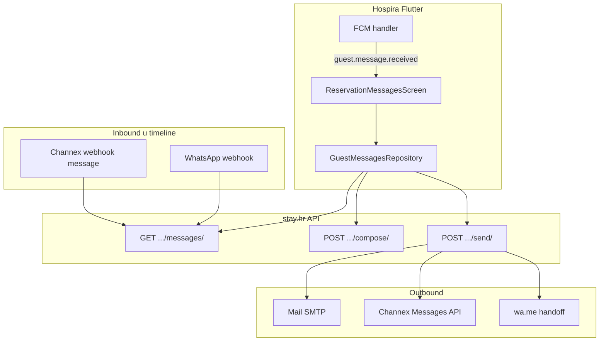
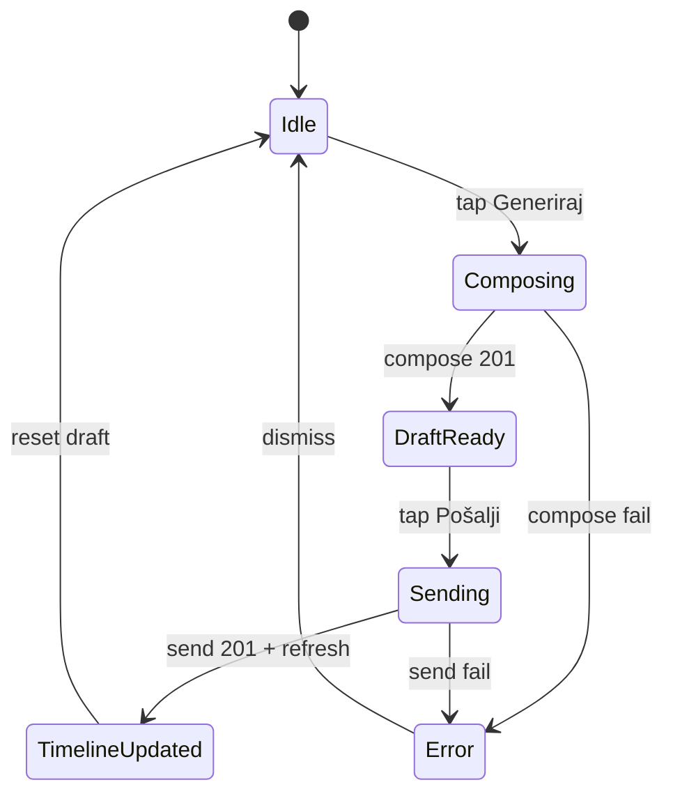

# Guest messages — Flutter (Hospira) implementacija

**Flutter repo:** [github.com/avrcanio/uzorita_flutter](https://github.com/avrcanio/uzorita_flutter) (`hr.finestar.hospira`)

**Backend:** [`reception_guest_messages_views.py`](../../backend/apps/api/reception_guest_messages_views.py), [`guest_message_send.py`](../../backend/apps/communications/guest_message_send.py), [`guest_compose.py`](../../backend/apps/communications/guest_compose.py)

**Reception web referenca (gotovo):** [`GuestMessagesPanel.tsx`](../../web/reception/app/_components/GuestMessagesPanel.tsx)

**Operativni runbook:** [`guest-messages-channels.md`](../operations/guest-messages-channels.md)

---

## Status i cilj

| Sloj | Status |
|------|--------|
| Backend API (timeline, compose, send, tri kanala) | **Gotovo** |
| Reception web UI | **Gotovo** |
| Flutter chat UI + tri kanala | **Pending** |

**Cilj u Flutteru:** zamijeniti email-centric flow chat prikazom (bubble thread) s tri kanala slanja — Mail, Channex (Booking.com), WhatsApp — prikazujući samo kanale koje backend označi kao dostupne.

---

## Arhitektura



---

## Tri kanala slanja

| Kanal | API `channel` | UI labela | Kada je `available` | Outbound | Inbound u timeline |
|-------|-----------------|-----------|---------------------|----------|-------------------|
| **Mail** | `email` | Mail / Email | Gost ima email (`booker_email` ili primarni guest) | Tenant SMTP | **Da** (IMAP poll, Booking.com `@guest.booking.com`) |
| **Channex** | `booking` | Channex | `import_source=channex` + Channex booking ID + tenant `channel_manager=channex` | Channex → B.com Poruke | **Da** (webhook) |
| **WhatsApp** | `whatsapp` | WhatsApp | Gost ima telefon (normaliziran `wa_id`) | `wa.me` handoff (ručno slanje) | **Da** (webhook) |

### Dostupnost po tipu rezervacije

| Tip rezervacije | Channex | Mail | WhatsApp | Default kanal |
|-----------------|---------|------|----------|---------------|
| Channex / B.com (`import_source == "channex"`) | Da | Da (fallback na `@guest.booking.com`) | Ako ima tel. | `booking` |
| Vlastita platforma (`source == "api"`) | **Ne** | **Primarni** | Ako ima tel. | `email` |
| B.com PDF import (`import_source == "booking_pdf"`) | **Ne** | Da | Ako ima tel. | `email` |

**Važno:** Flutter **ne smije** hardcodirati dostupnost kanala. Uvijek koristi `channels` iz compose response-a (ili ponovno compose prije slanja ako je prošlo puno vremena).

---

## API ugovor

**Base URL:** `https://api.stay.hr/api/v1`

**Auth:** `Authorization: Bearer <device_token>`  
**Scope:** `reception:read` (GET timeline), `reception:write` (compose, send)

**Reservation prefix:** `/reception/reservations/{reservationId}/messages/`

**Inbox prefix:** `/reception/message-threads/` (property-wide thread list)

> **Ne koristiti** legacy `/channex-messages/` u novom UI-ju — unified timeline je na `/messages/`.

---

### GET — inbox (thread list)

```http
GET /api/v1/reception/message-threads/
GET /api/v1/reception/message-threads/?needs_reply=1&sync=auto
```

| Query | Svrha |
|-------|--------|
| `page`, `page_size` | Paginacija (default 25) |
| `needs_reply=1` | Samo threadovi gdje je zadnja poruka **inbound** |
| `arriving_today=1` | Check-in danas (Europe/Zagreb) |
| `sync=auto\|1\|0` | Opcionalno osvježi Channex poruke prije agregacije |

**Response:**

```json
{
  "page": 1,
  "page_size": 25,
  "total": 3,
  "needs_reply_count": 1,
  "threads": [
    {
      "reservation_id": 798,
      "booker_name": "Daniela Heczko",
      "check_in": "2026-06-05",
      "check_out": "2026-06-06",
      "room_name": "Luxury Room Uzorita B&B",
      "status": "expected",
      "arrives_today": true,
      "last_message_at": "2026-06-05T17:20:00+00:00",
      "last_message_preview": "Dear Daniela…",
      "last_channel": "booking",
      "last_channels": ["booking"],
      "last_direction": "inbound",
      "needs_reply": true
    }
  ]
}
```

**Flutter UX (Hospira):**

- Bottom nav srednji slot: **Recenzije** ↔ **Poruke** (ponovni tap dok je aktivan)
- Default kanal slanja: **`channels.default_channel`** iz API-ja (obično `email` kad je dostupan), inače WhatsApp → booking
- Promjena kanala: **long-press** na Send → bottom sheet
- AI compose: gumb u inputu → sheet (Check-in / Reply / Custom)
- **WhatsApp resend:** long-press na **outbound WhatsApp** poruku (handoff) → odabir Channex ili mail → odmah pošalji isti tekst (compose `body_text` + send)

---

### GET — timeline (chat)

```http
GET /api/v1/reception/reservations/798/messages/
GET /api/v1/reception/reservations/798/messages/?sync=1
```

#### Query `sync` (samo Channex rezervacije)

| Vrijednost | Ponašanje |
|------------|-----------|
| `auto` (default) | Ako u bazi nema Channex poruka, povući ih iz Channex API-ja |
| `1` | Uvijek osvježi iz Channex API-ja — **koristi za pull-to-refresh** |
| `0` | Samo lokalna baza, bez Channex API poziva |

**Response:** JSON niz, sortiran asc po `created_at`:

```json
[
  {
    "id": 3000000042,
    "source": "booking",
    "direction": "outbound",
    "channel": "booking",
    "channels": ["booking", "whatsapp"],
    "body_text": "Poštovana Anka Dorić…",
    "created_at": "2026-06-06T15:41:00+02:00",
    "status": "sent",
    "sent_by_name": null,
    "from_email": null,
    "wa_me_url": null
  },
  {
    "id": 4000000010,
    "source": "inbound",
    "direction": "inbound",
    "channel": "email",
    "channels": ["email"],
    "body_text": "Poštovani Wolfgang…",
    "created_at": "2026-06-04T16:00:00+00:00",
    "status": "sent",
    "sent_by_name": "Tablet R1",
    "wa_me_url": null
  }
]
```

#### Polja timeline itema

| Polje | Tip | Značenje |
|-------|-----|----------|
| `id` | int | Stabilni ID za UI key. Channex: `3_000_000_000 + pk`, WhatsApp: `2_000_000_000 + pk`, email outbound: raw PK |
| `direction` | string | `inbound` (gost, lijevo) / `outbound` (recepcija, desno) |
| `channel` | string | Primarni kanal (`booking` \| `email` \| `whatsapp`) — backward compat |
| `channels` | string[] | Svi kanali kroz koje je ista poruka prošla (deduplikacija na backendu) |
| `source` | string | `booking` (Channex), `whatsapp`, `outbound` (email audit), `inbound` |
| `body_text` | string | Sadržaj poruke — backend vraća formatiran tekst s `\n` prijelomima (Flutter: `Text(..., style: TextStyle(height: 1.35))` + **mora** `softWrap: true`; koristi `SelectableText` ili `Text` s eksplicitnim `\n`, ne `TextOverflow.ellipsis` na cijelom body-ju) |
| `created_at` | ISO8601 | Vrijeme poruke |
| `status` | string \| null | Outbound: `sent`, `failed`, `handoff_whatsapp`, `queued`; inbound: `null` |
| `sent_by_name` | string \| null | Ime API aplikacije (tablet) kod outbound |
| `wa_me_url` | string \| null | Obično `null` na timeline; popunjeno u send response za WhatsApp |

---

### POST compose — generiraj tekst

```http
POST /api/v1/reception/reservations/798/messages/compose/
Content-Type: application/json

{"intent": "checkin"}
```

#### Request body

| Polje | Obavezno | Vrijednosti |
|-------|----------|-------------|
| `intent` | Da* | `checkin` \| `reply` \| `custom` |
| `body_text` | Da* | Gotov tekst poruke — **bez LLM-a** (resend / relay s istim sadržajem) |
| `hint` | Ne | Tekstualni hint za LLM; posebno `"checkin ready"` nakon OCR |
| `language` | Ne | Override jezika (`hr`, `en`, `de`, `es`, `fr`) — rijetko potreban |

\* Obavezno je **`intent`** ili **`body_text`** (ne oba). Ako je poslan `body_text`, backend kreira draft s točnim tekstom (`llm_used: false`).

#### Resend primjer (WhatsApp → Channex / mail)

```http
POST /api/v1/reception/reservations/798/messages/compose/
Content-Type: application/json

{"body_text": "Parking is available behind the building."}
```

Zatim standardni `POST .../send/` s `channel: booking` ili `email`.

#### Response (201)

```json
{
  "draft_id": 55,
  "body_text": "Poštovani Wolfgang Gross…",
  "language": "de",
  "llm_used": false,
  "channels": {
    "email": {
      "available": true,
      "to": "pvaill.980290@guest.booking.com"
    },
    "whatsapp": {
      "available": true,
      "phone_raw": "+49 170 1234567",
      "phone_wa": "491701234567",
      "wa_me_url": "https://wa.me/491701234567?text="
    },
    "booking": {
      "available": true
    }
  }
}
```

#### Intents — ponašanje

| Intent | UI gumb | LLM | Napomena |
|--------|---------|-----|----------|
| `checkin` | Check-in | **Ne** (`llm_used: false`) | Deterministički predložak — vidi [whatsapp-checkin-template.md](../operations/whatsapp-checkin-template.md) |
| `reply` | Odgovor | Da (osim `hint: "checkin ready"`) | Nakon OCR apply automatski šalji `hint: "checkin ready"` |
| `custom` | Prilagođeno | Da (ako je LLM konfiguriran) | `hint` = slobodni opis što napisati |

---

### POST send — pošalji poruku

```http
POST /api/v1/reception/reservations/798/messages/send/
Content-Type: application/json

{
  "draft_id": 55,
  "channel": "booking",
  "body_text": "Uređeni tekst poruke."
}
```

#### Request body

| Polje | Obavezno | Vrijednosti |
|-------|----------|-------------|
| `draft_id` | Da | ID iz compose response-a |
| `channel` | Da | `email` \| `booking` \| `whatsapp` |
| `body_text` | Da | Konačni tekst (može biti editiran nakon compose) |
| `subject` | Ne | Samo za `email`; backend generira default ako izostane |

#### Response (201) — Channex / email

Isti oblik kao timeline item + dodatna polja:

```json
{
  "id": 3000000043,
  "source": "booking",
  "direction": "outbound",
  "channel": "booking",
  "body_text": "Uređeni tekst poruke.",
  "created_at": "2026-06-04T16:05:00+00:00",
  "status": "sent",
  "sent_by_name": "Tablet R1",
  "edited": false
}
```

#### Response (201) — WhatsApp handoff

```json
{
  "id": 13,
  "source": "outbound",
  "direction": "outbound",
  "channel": "whatsapp",
  "body_text": "Bok Wolfgang! Check-in info.",
  "created_at": "2026-06-04T16:05:00+00:00",
  "status": "handoff_whatsapp",
  "sent_by_name": "Tablet R1",
  "wa_me_url": "https://wa.me/491701234567?text=Bok%20Wolfgang…",
  "edited": false
}
```

**Flutter akcija za WhatsApp:** otvori `wa_me_url` u browseru / WhatsApp app (`url_launcher`). Recepcija ručno pritisne Send u WhatsAppu — poruka se auditira u timeline kao outbound.

#### Greške (400)

| Uvjet | Response |
|-------|----------|
| Nevaljani `draft_id` | `{"draft_id": ["Draft not found for this reservation."]}` |
| Kanal nije dostupan | `{"channel": ["No guest email on this reservation."]}` ili slično |
| Channex 403 / nije konfiguriran | `{"channel": ["…"]}` |

---

## Korak-po-korak implementacija u Flutteru

### Faza A — Modeli i API klijent

#### A1. Dart modeli

```dart
class GuestMessageTimelineItem {
  final int id;
  final String source;       // booking | whatsapp | outbound | inbound
  final String direction;    // inbound | outbound
  final String channel;      // primary: booking | email | whatsapp
  final List<String> channels; // all delivery channels when deduplicated
  final String bodyText;
  final DateTime createdAt;
  final String? status;
  final String? sentByName;
  final String? waMeUrl;

  bool get isInbound => direction == 'inbound';
  bool get isOutbound => direction == 'outbound';
}

class GuestMessageChannelInfo {
  final bool available;
  final String? emailTo;       // email.to
  final String? phoneRaw;      // whatsapp.phone_raw
  final String? phoneWa;       // whatsapp.phone_wa
  final String? waMeUrl;       // whatsapp.wa_me_url (prazan body)
}

class GuestMessageChannels {
  final GuestMessageChannelInfo email;
  final GuestMessageChannelInfo whatsapp;
  final GuestMessageChannelInfo booking;
}

class GuestMessageComposeResult {
  final int draftId;
  final String bodyText;
  final String language;
  final bool llmUsed;
  final GuestMessageChannels channels;
}
```

#### A2. Repository

```dart
abstract class GuestMessagesRepository {
  Future<List<GuestMessageTimelineItem>> fetchTimeline(
    int reservationId, {
    String sync = 'auto', // '0' | 'auto' | '1'
  });

  Future<GuestMessageComposeResult> compose(
    int reservationId, {
    required String intent, // checkin | reply | custom
    String? hint,
    String? language,
  });

  Future<GuestMessageTimelineItem> send(
    int reservationId, {
    required int draftId,
    required String channel, // email | booking | whatsapp
    required String bodyText,
    String? subject,
  });
}
```

**Endpointi:**

```dart
// GET  /reception/reservations/$id/messages/?sync=$sync
// POST /reception/reservations/$id/messages/compose/
// POST /reception/reservations/$id/messages/send/
```

---

### Faza B — Ekran poruka (chat UI)

#### B1. Navigacija

- Ulaz: detalj rezervacije → sekcija/tab **Poruke** (ili ikona chat bubble)
- Route: npr. `/reservations/:id/messages`
- Deep link iz FCM push-a: isti route s `reservation_id` iz payloada

#### B2. Layout (referenca: web `GuestMessagesPanel`)

```
┌─────────────────────────────────────┐
│  Poruke gostu              [Osvježi]│
├─────────────────────────────────────┤
│                                     │
│  ┌──────────────────┐               │  ← inbound (lijevo, svijetla pozadina)
│  │ Channex · 04.06. │               │
│  │ Ok merci du mail │               │
│  └──────────────────┘               │
│               ┌──────────────────┐  │  ← outbound (desno, brand boja)
│               │ Mail · 04.06.    │  │
│               │ Poštovani…       │  │
│               └──────────────────┘  │
│                                     │
├─────────────────────────────────────┤
│  [Check-in] [Odgovor] [Prilagođeno] │  ← intent gumbi
│  [Generiraj]                        │
├─────────────────────────────────────┤
│  (nakon compose)                    │
│  ┌─────────────────────────────┐    │
│  │ TextField — body_text       │    │
│  └─────────────────────────────┘    │
│  ○ Channex  ○ Mail  ○ WhatsApp      │  ← samo available kanali
│  hint ispod odabranog kanala        │
│  [Pošalji]                          │
└─────────────────────────────────────┘
```

#### B3. Bubble komponenta

| Element | Pravilo |
|---------|---------|
| Poravnanje | `inbound` → lijevo; `outbound` → desno |
| Badge | Prikaži kanale iz `channels` (ili `[channel]` ako je samo jedan): **Channex** · **Mail** · **WhatsApp**, odvojeno s ` · ` |
| Vrijeme | `created_at` → lokalni format `dd.MM. HH:mm` |
| Autor | `sent_by_name` samo kod outbound (npr. „Tablet R1”) |
| Tekst | `body_text` — prikaži s `Text(body, style: TextStyle(height: 1.35))`; **ne** stavljaj cijeli body u jedan `Row`/`Flexible` s `maxLines: 1`. Za prijelome redova koristi običan `Text` (Flutter po defaultu poštuje `\n`) ili `SelectableText`. |

#### B4. Prazno stanje

- Nema poruka: „Još nema poruka s gostom."
- Nema dostupnih kanala nakon compose: upozorenje „Nema dostupnog kanala za slanje."

---

### Faza C — Compose → Send flow

State machine:



#### C1. Intent gumbi

```dart
enum ComposeIntent { checkin, reply, custom }
```

- **Check-in:** compose bez `hint`
- **Odgovor:** compose s opcionalnim `hint`; ako je postavljen lokalni OCR flag → automatski `hint: "checkin ready"` (vidi Faza E)
- **Prilagođeno:** prikaži TextField za slobodni `hint` prije compose

#### C2. Odabir kanala

Redoslijed prikaza (kao web): `email` → `whatsapp` → `booking`

```dart
String defaultChannel(GuestMessageChannels channels) {
  if (channels.defaultChannel != null && channels.defaultChannel!.isNotEmpty) {
    return channels.defaultChannel!;
  }
  if (channels.email.available) return 'email';
  if (channels.whatsapp.available) return 'whatsapp';
  if (channels.booking.available) return 'booking';
  return '';
}

List<String> availableChannels(GuestMessageChannels channels) {
  const order = ['email', 'whatsapp', 'booking'];
  return order.where((c) => _isAvailable(channels, c)).toList();
}
```

Hint ispod radio gumba (prevedi):

| Kanal | Hint tekst |
|-------|------------|
| `booking` | „Poruka ide u Booking.com extranet (Channex)" |
| `email` | „Šalje se na: {channels.email.to}" |
| `whatsapp` | „Otvara WhatsApp na broj: {channels.whatsapp.phone_raw}" |

#### C3. Slanje

```dart
Future<void> handleSend() async {
  final result = await repo.send(
    reservationId,
    draftId: draftId!,
    channel: selectedChannel,
    bodyText: bodyController.text.trim(),
  );

  if (selectedChannel == 'whatsapp' && result.waMeUrl != null) {
    await launchUrl(Uri.parse(result.waMeUrl!), mode: LaunchMode.externalApplication);
    showSnackBar('WhatsApp otvoren — pošaljite poruku ručno.');
  } else {
    showSnackBar('Poruka poslana.');
  }

  // Reset draft state
  draftId = null;
  bodyController.clear();

  // Refresh timeline
  await loadTimeline(sync: '1');
}
```

**Validacija prije slanja:**

- `draftId != null` — inače „Prvo generirajte poruku"
- `bodyText.trim().isNotEmpty`
- `selectedChannel.isNotEmpty`

---

### Faza D — Refresh i sync

| Akcija | API poziv |
|--------|-----------|
| Otvaranje ekrana | `GET …/messages/?sync=auto` |
| Pull-to-refresh | `GET …/messages/?sync=1` |
| Nakon uspješnog send | `GET …/messages/?sync=0` (dovoljno — send response već sadrži novu poruku) ili `sync=1` za Channex |

Za Channex rezervacije (`importSource == 'channex'`) pull-to-refresh **mora** koristiti `sync=1` da se povuku poruke koje možda nisu stigle webhookom.

---

### Faza E — OCR „checkin ready" integracija

Povezano: [whatsapp-checkin-template.md](../operations/whatsapp-checkin-template.md)

1. Nakon uspješnog **OCR apply** (eVisitor flow) postavi lokalni flag na rezervaciji, npr. `pendingCheckinReadyReply = true`
2. Sljedeći **Odgovor → Generiraj** automatski šalje:
   ```json
   {"intent": "reply", "hint": "checkin ready"}
   ```
   Recepcija **ne vidi** hint polje — backend vraća deterministički tekst (`llm_used: false`)
3. Nakon slanja poruke (ili izlaska iz OCR flowa) resetiraj flag
4. **Ne** šalji poseban `language` — backend koristi isti jezik kao check-in poruku (iz `booker_country`)

---

### Faza F — FCM push (inbound poruke)

Backend šalje push **`guest.message.received`** kad stigne nova inbound poruka na linkanoj rezervaciji:

| Izvor | Trigger |
|-------|---------|
| Channex / Booking.com | `process_channex_message_webhook` — samo nova guest poruka |
| WhatsApp | `process_inbound_message` — nakon linkanja na rezervaciju |

#### FCM data payload

Svi ključevi su stringovi:

```json
{
  "type": "guest.message.received",
  "reservation_id": "798",
  "summary": "Ok merci du mail",
  "booking_code": "5036489024",
  "channel": "booking",
  "tenant_id": "2",
  "origin_installation_id": ""
}
```

#### Flutter handler

```dart
void onFcmData(Map<String, dynamic> data) {
  if (data['type'] != 'guest.message.received') return;

  final reservationId = int.tryParse(data['reservation_id'] ?? '');
  if (reservationId == null) return;

  // 1. Ako je messages ekran otvoren za tu rezervaciju → refresh timeline
  // 2. Inače → badge na rezervaciji / inbox notifikacija
  // 3. Tap na notifikaciju → navigacija na /reservations/$reservationId/messages
}
```

**Postavke:** toggle **Poruka od gosta** (`guest_message`) u postavkama notifikacija — poštuj postojeći FCM preference model u Hospiri.

> FCM ne zamjenjuje pull-to-refresh — koristi se za real-time obavijest; timeline i dalje učitava GET.

---

## Lokalizacija (HR primjeri)

| Ključ | Tekst |
|-------|-------|
| `guestMessages.title` | Poruke gostu |
| `guestMessages.empty` | Još nema poruka s gostom. |
| `guestMessages.intentCheckin` | Check-in |
| `guestMessages.intentReply` | Odgovor |
| `guestMessages.intentCustom` | Prilagođeno |
| `guestMessages.composeAction` | Generiraj |
| `guestMessages.sendAction` | Pošalji |
| `guestMessages.channelBooking` | Channex |
| `guestMessages.channelEmail` | Mail |
| `guestMessages.channelWhatsapp` | WhatsApp |
| `guestMessages.whatsappHandoff` | WhatsApp otvoren — pošaljite poruku ručno. |
| `guestMessages.sendSuccess` | Poruka poslana. |
| `guestMessages.composeFirst` | Prvo generirajte poruku. |
| `guestMessages.noChannel` | Nema dostupnog kanala za slanje. |

---

## Predložena struktura datoteka (uzorita_flutter)

```
lib/
  features/
    guest_messages/
      data/
        guest_messages_repository.dart
        guest_messages_api.dart
        models/
          guest_message_timeline_item.dart
          guest_message_compose_result.dart
      presentation/
        reservation_messages_screen.dart
        widgets/
          message_bubble.dart
          channel_picker.dart
          compose_intent_bar.dart
      guest_messages_providers.dart   // Riverpod / Bloc
```

Integriraj u postojeći reservation detail — ne gradi zaseban tab bar ako već postoji pattern za sub-sekcije.

---

## Što NE implementirati (svjesno izvan scope-a)

| Feature | Razlog |
|---------|--------|
| Email inbound (mailbox parse) | **Da** — Celery `guest-email-imap-poll` (2 min) + `poll_guest_email` CLI |
| Channex attachments | `have_attachment` postoji u modelu, download nije implementiran |
| Legacy `/channex-messages/` endpoint | Zamijenjen unified `/messages/` |
| Guest app / in-app messaging | Ne postoji za direct booking |
| Automatsko slanje WhatsApp poruke | Samo handoff — recepcija šalje ručno |

---

## Test plan (acceptance criteria)

### 1. Channex rezervacija

- [ ] Timeline prikazuje inbound `booking` poruke (lijevo)
- [ ] Outbound `booking` poruke desno, badge „Channex"
- [ ] Compose → tri kanala ako gost ima email + tel.
- [ ] Default kanal = Channex
- [ ] Send `booking` → poruka vidljiva u B.com extranet Poruke
- [ ] Pull-to-refresh (`sync=1`) povlači nove poruke

### 2. Vlastita platforma (`source=api`)

- [ ] Channel picker: samo Mail + WhatsApp (Channex **nije** u listi)
- [ ] Default kanal = Mail
- [ ] Send `email` → outbound u timeline, status `sent`

### 3. WhatsApp handoff

- [ ] Send `whatsapp` → otvara `wa.me` URL s encoded body
- [ ] Dugi check-in tekst ne ruši send (regresija: URL > 512 znakova)
- [ ] Outbound audit u timeline, status `handoff_whatsapp`

### 4. Compose

- [ ] Check-in → `llm_used: false`, ispravan jezik (DE gost → njemački tekst)
- [ ] Reply nakon OCR → automatski `checkin ready` template
- [ ] Custom s hintom → `llm_used: true` (ako je LLM konfiguriran na serveru)

### 5. FCM

- [ ] Inbound Channex poruka → push „Nova poruka"
- [ ] Tap → otvara **MessageThreadScreen** (`/reservations/{id}/messages`)
- [ ] Tab Poruke aktivan → inbox refresh + badge `needs_reply_count`

### 6. Greške

- [ ] Send bez compose → jasna poruka korisniku
- [ ] Send whatsapp bez telefona → 400, ne crash
- [ ] Compose bez `reception:write` → 403

---

## Troubleshooting (Flutter ↔ backend)

| Simptom | Provjera |
|---------|----------|
| `booking.available=false` na Channex rezervaciji | `reservation.importSource == 'channex'`? `externalId` ima Channex booking ID? |
| Inbound ne stiže u timeline | Webhook `message` event u Channex UI; probaj `sync=1` |
| Send booking → 400/502 | Channex Messages app nije aktivan — vidi [guest-messages-channels.md](../operations/guest-messages-channels.md) |
| Mail send → `status: failed` | Tenant SMTP nije konfiguriran u Reception settings |
| WhatsApp inbound ne stiže | WhatsApp webhook + link na rezervaciju |

---

## Povezani dokumenti

- [`guest-messages-channels.md`](../operations/guest-messages-channels.md) — operativni runbook (webhook, CLI sync)
- [`whatsapp-checkin-template.md`](../operations/whatsapp-checkin-template.md) — check-in compose flow i jezici
- [`channex-uzorita-booking-channel.md`](../integrations/channex-uzorita-booking-channel.md) — Channex messaging setup
- [`guest-reviews-channex.md`](../operations/guest-reviews-channex.md) — **Recenzije** (odvojena feature grana, ne miješati s porukama)
