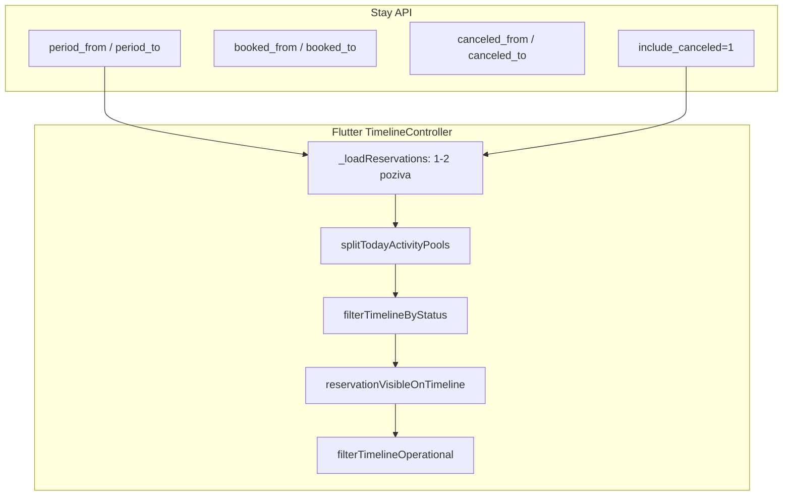

# Hospira — timeline filteri (Stay API + Flutter)

**Flutter repo:** [github.com/avrcanio/uzorita_flutter](https://github.com/avrcanio/uzorita_flutter) (`hr.finestar.hospira`)

**Backend:** `backend/apps/api/reception_views.py` → `ReservationTimelineListView`

**Endpoint:** `GET /api/v1/reception/reservations/`

Dokument opisuje ugovor između Stay API-ja i Hospira Timeline ekrana: koji query parametri postoje, kako ih backend tumači, i kako Flutter trenutno učitava i filtrira podatke.

---

## Arhitektura



U normalnom modu Flutter šalje **dva paralelna poziva** (operativna lista + kombinirani današnji pool s `include_canceled=1`), zatim `splitTodayActivityPools` dijeli odgovor na booked/canceled poolove za stat kartice. Today fokus koristi **jedan** kombinirani poziv.

---

## Backend — query parametri

Implementacija: `ReservationTimelineListView.get_queryset()` u [`reception_views.py`](../../backend/apps/api/reception_views.py).

Testovi: `test_timeline_*` u [`test_reception_api.py`](../../backend/apps/api/tests/test_reception_api.py).

| Parametar | Kada | Ponašanje |
|-----------|------|-----------|
| `period_from`, `period_to` | Operativni timeline (Danas / Tjedan / Mjesec) | Dolazak **ili** odlazak u rasponu **ili** `status=checked_in` (uvijek uključen) |
| `booked_from`, `booked_to` | Brojač „Nove danas” / Today fokus | Po `booked_at` u `[00:00, 00:00)` Europe/Zagreb; **isključuje** `canceled` |
| `canceled_from`, `canceled_to` | Brojač „Otkazane danas” / Today fokus | Samo `status=canceled`, po `canceled_at` |
| `include_canceled=1` | Optimizacija (1 poziv umjesto dva) | Union booked + canceled istog dana, sort `-activity_at` |
| `status` | Status dropdown | Filtrira queryset prije ostalih grananja |
| `search` | Globalna pretraga | `external_id`, soba, ime gosta |

**Pravilo prioriteta:** kad su postavljeni `booked_from` i `booked_to`, parametri `period_from` / `period_to` se **ignoriraju** (vidi `test_timeline_booked_filter_ignores_period_params`).

Datumi `booked_*` / `canceled_*` koriste kalendarski dan u **Europe/Zagreb** — `[00:00, 00:00)` lokalno. **Ne koristiti UTC datum** za ove parametre.

---

## Operativni filter — `period_from` / `period_to`

Glavni mod za Timeline (Danas, Sutra, Tjedan, Mjesec):

```http
GET /api/v1/reception/reservations/?period_from=2026-06-05&period_to=2026-06-06
Authorization: Bearer {api_token}
```

| Parametar | Obavezno | Opis |
|-----------|----------|------|
| `period_from` | da | Početak raspona (uključivo), ISO datum |
| `period_to` | da | Kraj raspona (uključivo), ISO datum |

**Vraća:** rezervacije s dolaskom ili odlaskom u rasponu, plus sve s `status=checked_in` bez obzira na datume boravka.

Opcionalno: `status=expected` (ili drugi status) sužava queryset prije period filtera.

---

## Dnevni filter — rezervirano / otkazano

### Samo rezervirano danas

```http
GET /api/v1/reception/reservations/?booked_from=2026-06-05&booked_to=2026-06-06
```

| Parametar | Obavezno | Opis |
|-----------|----------|------|
| `booked_from` | da | Početak dana (uključivo) |
| `booked_to` | da | Sljedeći dan (isključivo) — npr. za 5.6.: `booked_from=2026-06-05&booked_to=2026-06-06` |

Vraća rezervacije s `booked_at` u tom danu, **bez** `status=canceled`.

### Samo otkazano danas

```http
GET /api/v1/reception/reservations/?canceled_from=2026-06-05&canceled_to=2026-06-06
```

| Parametar | Obavezno | Opis |
|-----------|----------|------|
| `canceled_from` | da | Početak dana (uključivo) |
| `canceled_to` | da | Sljedeći dan (isključivo) |

Vraća samo `status=canceled` s `canceled_at` u tom danu.

---

## Kombinirani dnevni filter (preporučeno za API klijente)

Za ekran **„rezervirano i otkazano danas“** jedan API poziv:

```http
GET /api/v1/reception/reservations/?booked_from=2026-06-05&booked_to=2026-06-06&include_canceled=1
Authorization: Bearer {api_token}
```

| Parametar | Obavezno | Opis |
|-----------|----------|------|
| `booked_from` | da | Početak dana (uključivo) |
| `booked_to` | da | Sljedeći dan (isključivo) |
| `include_canceled` | da (za combined) | `1`, `true` ili `yes` |

**Vraća union:**

- rezervacije **rezervirane** u tom danu (`booked_at`, status ≠ `canceled`)
- rezervacije **otkazane** u tom danu (`canceled_at`, status = `canceled`)

Sortirano po vremenu aktivnosti (najnovije prvo). Polja `booked_at`, `canceled_at` i `status` omogućuju razlikovanje u UI-u.

### Alternativa — implicitni combined mode

Ako se pošalju **oba** para datuma (bez `include_canceled`), API također vraća union:

```http
GET /api/v1/reception/reservations/?booked_from=2026-06-05&booked_to=2026-06-06&canceled_from=2026-06-05&canceled_to=2026-06-06
```

Preporuka: koristiti `include_canceled=1` s jednim parom datuma — manje parametara, isti rezultat kad su rasponi jednaki.

---

## Globalna pretraga — `search`

```http
GET /api/v1/reception/reservations/?search=Ivan
```

Pretražuje `external_id`, naziv sobe, ime i prezime gosta. Ne koristi `period_*` ni `booked_*`.

---

## UI preporuke

| `status` | Prikaz |
|----------|--------|
| `expected`, `checked_in`, … | Nova rezervacija (zelena / neutralna) |
| `canceled` | Otkazano (badge, npr. crvena) |

Check-in datum (`check_in_date`) može biti u budućnosti (npr. 2027.) — filter po **datumu rezervacije/otkaza** ne gleda dolazak.

---

## Napomena o ponoći (timezone)

Otkazi nakon ponoći po Zagrebu ulaze u **sljedeći** kalendarski dan.

Primjer: otkaz u `2026-06-05 00:11` (Zagreb) → vidljiv u filteru za **5.6.**, ne za 4.6.

---

## Flutter — trenutna implementacija

Izvor: [`timeline_controller.dart`](https://github.com/avrcanio/uzorita_flutter/blob/main/lib/features/reception/presentation/timeline_controller.dart) u repou `uzorita_flutter`.

### Datum „danas”

Koristi se [`DateUtilsIso`](https://github.com/avrcanio/uzorita_flutter/blob/main/lib/core/utils/date_utils.dart) (`Europe/Zagreb`), ne UTC ni lokalno vrijeme uređaja:

```dart
final today = DateUtilsIso.todayIso();
final todayRange = (
  from: today,
  to: DateUtilsIso.addDaysIso(today, 1),
);
// booked_to / canceled_to = todayRange.to (sljedeći dan, isključivo)
```

### Operativni mod (`focusLens == operational`, default)

Dva paralelna poziva u `_loadReservations`:

1. `period_from` / `period_to` (+ opcionalni `status` iz dropdowna)
2. `booked_from` / `booked_to` + `include_canceled=1` — kombinirani pool za stat kartice „Nove danas” i „Otkazane danas”

Odgovor drugog poziva dijeli [`splitTodayActivityPools`](https://github.com/avrcanio/uzorita_flutter/blob/main/lib/features/reception/presentation/timeline_summary.dart) na `_bookedTodayPool` i `_canceledTodayPool`.

Klijentski slojevi (redoslijed):

1. `filterTimelineByStatus` — status dropdown + checkbox otkazane
2. `reservationVisibleOnTimeline` — period; `checked_in` uvijek vidljiv ([`timeline_period_filter.dart`](https://github.com/avrcanio/uzorita_flutter/blob/main/lib/features/reception/presentation/timeline_period_filter.dart))
3. `filterTimelineOperational` — Dolasci / Odlasci / Prijavljeni ([`timeline_operational_filter.dart`](https://github.com/avrcanio/uzorita_flutter/blob/main/lib/features/reception/presentation/timeline_operational_filter.dart))

**Default:** `_operationalFilter = arrivals` — lista na startu prikazuje samo dolazak u odabranom periodu (npr. Danas).

**Status dropdown** skriven kad je `statCardFilterActive`:

- operativna kartica ≠ `none` (Dolasci / Odlasci / Prijavljeni)
- Today fokus (`focusLens == activityToday`)
- globalna pretraga

Vidi [`timeline_status_filter_field.dart`](https://github.com/avrcanio/uzorita_flutter/blob/main/lib/features/reception/presentation/widgets/timeline_status_filter_field.dart).

Korisnik može tapnuti aktivnu karticu (npr. Dolasci) da je ugasi → `operationalFilter = none` → puna operativna lista + Status dropdown se ponovo prikaže.

### Today fokus (`focusLens == activityToday`)

Jedan poziv s `booked_from` / `booked_to` + `include_canceled=1`. `splitTodayActivityPools` dijeli odgovor na booked i canceled poolove.

Lista u sekcijama `__booked_today__` i `__canceled_today__`. Booked pool isključuje `canceled` i `no_show`.

Otkazane stavke vizualno označene prema `status == "canceled"`.

---

## Reference

| Sloj | Datoteka |
|------|----------|
| Backend view | `backend/apps/api/reception_views.py` → `ReservationTimelineListView` |
| Backend testovi | `backend/apps/api/tests/test_reception_api.py` → `test_timeline_*` |
| Flutter controller | `lib/features/reception/presentation/timeline_controller.dart` |
| Flutter period filter | `lib/features/reception/presentation/timeline_period_filter.dart` |
| Flutter stat poolovi | `lib/features/reception/presentation/timeline_summary.dart` |
| Flutter API klijent | `lib/features/reception/data/reception_api.dart` |
