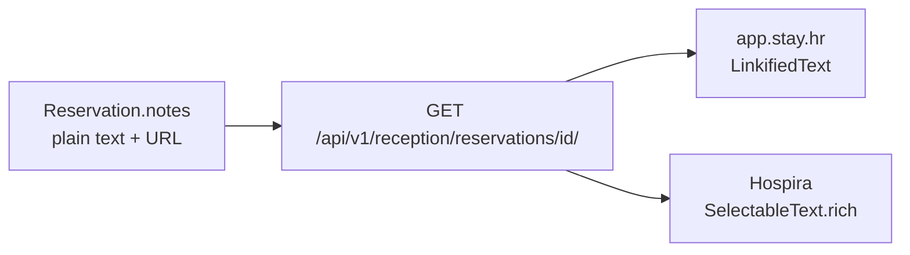

# Napomena rezervacije — klikabilni linkovi (Flutter / Hospira)

**Flutter repo:** [github.com/avrcanio/uzorita_flutter](https://github.com/avrcanio/uzorita_flutter) (`hr.finestar.hospira`)

**Reception web referenca (gotovo):** [`linkifyText.tsx`](../../web/reception/lib/linkifyText.tsx), [`ReservationDetailPanel.tsx`](../../web/reception/app/_components/ReservationDetailPanel.tsx)

**API:** `GET /api/v1/reception/reservations/{id}/` → polje `notes` (string, plain text)

---

## Status i cilj

| Sloj | Status |
|------|--------|
| Backend API (`notes` TextField) | **Gotovo** — nema promjene |
| Reception web (`LinkifiedText`) | **Gotovo** |
| Hospira tablet (Flutter) | **TODO** — ovaj dokument |

**Cilj:** URL-ovi u polju `notes` (npr. `https://share.google/oE0qrZ5ObiPFbwzO7` na rezervaciji #22) moraju biti tapabilni i otvarati se u vanjskom browseru (Chrome/Safari), uz isti UX kao na `app.stay.hr`.

---

## Arhitektura



Backend ne linkificira napomenu — parsiranje je isključivo na klijentu (web i Flutter).

---

## Gdje mijenjati u Flutteru

U repou `uzorita_flutter` pretražiti:

- `reservation.notes`
- string literal `"notes"` ili lokalizirani ključ za „Napomena”
- widget `Text(` koji prikazuje napomenu na detail ekranu rezervacije

Tipično mjesto: **reservation detail** ekran (timeline drill-down ili sličan panel s detaljima rezervacije).

Zamijeniti:

```dart
Text(reservation.notes)
```

s reusable widgetom `LinkifiedText` (vidi dolje).

---

## Implementacija

### 1. Ovisnost: `url_launcher`

Provjeriti `pubspec.yaml`. Ako `url_launcher` nije prisutan:

```yaml
dependencies:
  url_launcher: ^6.3.0
```

Prema [url_launcher dokumentaciji](https://pub.dev/packages/url_launcher), na Androidu/iOS-u obično nije potrebna dodatna konfiguracija za `https://` i `http://` linkove.

### 2. Nova datoteka

Preporučena lokacija: `lib/widgets/linkified_text.dart` (ili `lib/utils/linkify.dart`).

Pravila (usklađena s web [`linkifyText.tsx`](../../web/reception/lib/linkifyText.tsx)):

| Pravilo | Detalj |
|---------|--------|
| Regex | Samo `https?://…` (uključuje `share.google/…`) |
| Trailing interpunkcija | `.` i `,` na kraju URL-a ostaju **izvan** linka |
| Bez HTML-a | `SelectableText.rich` + `TextSpan` — ne renderirati HTML iz napomene |
| Stil linka | Plava boja + underline (uskladiti s Hospira temom) |
| Otvaranje | `launchUrl(..., mode: LaunchMode.externalApplication)` |

### 3. Primjer koda

```dart
import 'package:flutter/gestures.dart';
import 'package:flutter/material.dart';
import 'package:url_launcher/url_launcher.dart';

final _urlRegex = RegExp(r'https?://[^\s]+');

(String href, String trailing) _splitTrailingPunct(String url) {
  final match = RegExp(r'^(https?://[^\s]*?)([.,]+)$').firstMatch(url);
  if (match != null) {
    return (match.group(1)!, match.group(2)!);
  }
  return (url, '');
}

Future<void> _openUrl(String href) async {
  final uri = Uri.parse(href);
  if (!await launchUrl(uri, mode: LaunchMode.externalApplication)) {
    debugPrint('Could not launch $href');
  }
}

/// Plain text s klikabilnim http(s) URL-ovima.
class LinkifiedText extends StatelessWidget {
  const LinkifiedText(
    this.text, {
    super.key,
    this.style,
  });

  final String text;
  final TextStyle? style;

  @override
  Widget build(BuildContext context) {
    final spans = <InlineSpan>[];
    var start = 0;

    for (final match in _urlRegex.allMatches(text)) {
      if (match.start > start) {
        spans.add(TextSpan(text: text.substring(start, match.start)));
      }
      final raw = match.group(0)!;
      final (href, trailing) = _splitTrailingPunct(raw);
      spans.add(
        TextSpan(
          text: href,
          style: (style ?? const TextStyle()).copyWith(
            color: Colors.blue,
            decoration: TextDecoration.underline,
          ),
          recognizer: TapGestureRecognizer()..onTap = () => _openUrl(href),
        ),
      );
      if (trailing.isNotEmpty) {
        spans.add(TextSpan(text: trailing));
      }
      start = match.end;
    }

    if (start < text.length) {
      spans.add(TextSpan(text: text.substring(start)));
    }

    return SelectableText.rich(
      TextSpan(style: style, children: spans),
    );
  }
}
```

### 4. Korištenje na detail ekranu

```dart
if (reservation.notes != null && reservation.notes!.isNotEmpty) ...[
  Text('Napomena', style: theme.textTheme.titleSmall),
  LinkifiedText(
    reservation.notes!,
    style: theme.textTheme.bodyMedium?.copyWith(color: Colors.grey),
  ),
],
```

---

## Test plan (tablet)

1. **Rezervacija #22** — tap na Google share link (`https://share.google/…`) otvara browser
2. **Napomena bez URL-a** — vizualno nepromijenjeno (običan tekst)
3. **URL s točkom na kraju** — npr. `Pogledaj https://example.com.` — točka ostaje izvan linka
4. **Više URL-ova u jednoj napomeni** — svaki link zasebno klikabilan

---

## Ograničenja

- Linkificiraju se samo URL-ovi s shemom `http://` ili `https://` (ne `www.example.com` bez sheme)
- Google share link (`share.google/…`) otvara Google redirect — ponašanje ovisi o Googleu, ne o stay.hr
- Django admin već linkificira URL-ove u prikazu — izvan scopea Hospire

---

## Povezano

- [`no-show-flutter.md`](no-show-flutter.md) — no-show akcija u Hospiri
- [`guest-messages-flutter.md`](guest-messages-flutter.md) — guest messages chat UI
- [`hospira-timeline-filter.md`](hospira-timeline-filter.md) — timeline filteri
