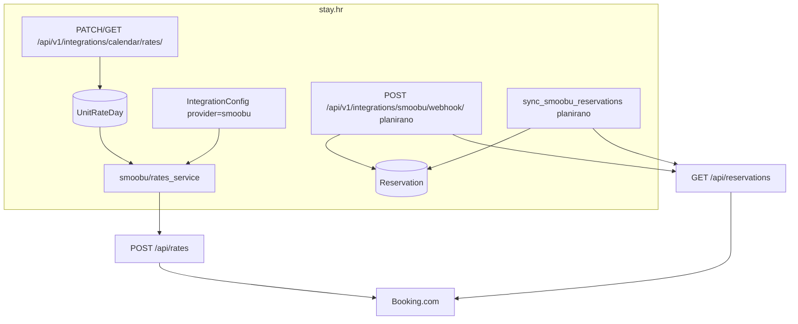

# Smoobu integracija — cijene i rezervacije (stay.hr)

Dokument za kasnije strojno učenje i automatizaciju. Sažima kontekst, arhitekturu, modele, API ugovore, mapiranja i što je implementirano vs. planirano (svibanj 2026).

**Tenant produkcije:** `uzorita`  
**Channel manager (live Booking):** Smoobu (`https://login.smoobu.com`)  
**Cert/staging Booking:** Channex (property `channex-bcom-test`)

---

## 1. Poslovni cilj

| Područje | Danas (prije / paralelno) | Cilj |
|----------|---------------------------|------|
| **Cijene** | Ručni unos (mail, CSV), eventualno Smoobu UI | Jedan kalendar u stay.hr → push na Booking preko Smoobu `POST /api/rates` |
| **Rezervacije** | Booking XLS import (ručno) | Smoobu webhook + `sync_smoobu_reservations` → model `Reservation` |

**Pravilo kanala:** Isti Booking listing **ne smije** imati aktivno i Smoobu i Channex push. Live sobe R1–R6 = **samo Smoobu**. Demo/cert = **samo Channex**.

---

## 2. Arhitektura (visoka razina)



### Usporedba Channex vs Smoobu (reuse pattern)

| Channex (postojeće) | Smoobu (novo / plan) |
|---------------------|----------------------|
| `ChannelRatePlan` + `RatePlanDay` | `IntegrationConfig.apartments[]` + `UnitRateDay` |
| Više rate planova po sobi (`standard`, `non_refundable`) | **Jedna cijena po sobi po danu** |
| `channex/ari_service.apply_rate_updates` | `smoobu/rates_service.apply_rate_updates` |
| `channex/ari_views` | `calendar_views.CalendarRatesView` |
| `ChannexAriOutbox` (async flush) | Sync push u PATCH (outbox opcionalno kasnije) |
| `channex/booking_service` + webhook | `smoobu` webhook + `sync_smoobu_reservations` (**planirano**) |
| `import_source=channex`, `external_id=channex:{booking_id}` | `import_source=smoobu`, `external_id=str(smoobu_id)` (**planirano**) |

---

## 3. Mapiranje soba (Uzorita)

Iz Smoobu Advanced → API Keys → Accommodations:

| `properties.Unit.code` | Smoobu `apartment_id` | Napomena |
|------------------------|----------------------|----------|
| R1 | 3327457 | |
| R2 | 3327482 | |
| R3 | 3327487 | |
| R6 | 3328822 | |
| R4, R5 | *(dopuniti)* | Ako postoje u Smoobu i u bazi |

Konstante u kodu: `backend/apps/integrations/smoobu/mapping.py` → `UZORITA_SMOOBU_APARTMENTS`.

### IntegrationConfig (šifrirano)

```json
{
  "api_base": "https://login.smoobu.com",
  "api_key": "<rotated-secret>",
  "settings_channel_id": 6538582,
  "apartments": [
    { "unit_code": "R1", "smoobu_apartment_id": 3327457, "unit_id": 123 },
    { "unit_code": "R2", "smoobu_apartment_id": 3327482 }
  ],
  "push_rates_enabled": true,
  "default_channel_id_for_create": 70
}
```

- Provider: `IntegrationConfig.Provider.SMOOBU` (`"smoobu"`)
- Ključ **nikad** u git/chat; samo `config_encrypted` (Fernet). Vidi `docs/integrations/smoobu-key-rotation.md`.

**Management commands:**

```bash
docker compose exec django python manage.py seed_uzorita_smoobu_config
docker compose exec django python manage.py rotate_smoobu_api_key
```

---

## 4. Cijene — podatkovni model

### `UnitRateDay` (kanonski kalendar po sobi)

| Polje | Tip | Značenje |
|-------|-----|----------|
| `tenant_id` | FK | Multi-tenant |
| `unit_id` | FK → `properties.Unit` | Soba (npr. R1) |
| `date` | date | Dan |
| `rate` | Decimal(10,2) | Dnevna cijena (EUR ili valuta kanala) |
| `min_stay` | int, nullable | Min. boravak (noćenja) |
| `smoobu_synced_at` | datetime, nullable | `NULL` = čeka push na Smoobu |
| Unique | `(tenant, unit, date)` | Jedan zapis po sobi po danu |

**Zašto ne `RatePlanDay`:** Channex model veže više rate planova na `ChannelRatePlan`. Smoobu API prima **jednu** `daily_price` po apartmanu po operaciji datuma.

Migracija: `integrations/migrations/0010_unitrateday.py`.

---

## 5. Cijene — Smoobu API

Baza: `https://login.smoobu.com`  
Auth: header `Api-Key: <secret>`  
User-Agent: `stay.hr/1.0 (+https://stay.hr)` (Cloudflare blokira default Python UA)

### GET `/api/rates`

Query: `apartments[]=`, `start_date=YYYY-MM-DD`, `end_date=YYYY-MM-DD`

Odgovor (pojednostavljeno):

```json
{
  "data": {
    "3327457": {
      "2026-06-01": {
        "price": 140.0,
        "min_length_of_stay": 2,
        "available": 1
      }
    }
  }
}
```

Klijent: `SmoobuClient.get_rates()`.

### POST `/api/rates`

```json
{
  "apartments": [3327457],
  "operations": [
    {
      "dates": ["2026-06-01:2026-06-03", "2026-06-10"],
      "daily_price": 150.0,
      "min_length_of_stay": 2,
      "available": 1
    }
  ]
}
```

- Jedan datum: `"2026-06-01"`
- Raspon: `"2026-06-01:2026-06-03"`
- Uspjeh: `{ "success": true }`
- Rate limit: header `X-RateLimit-Retry-After` (Unix timestamp); klijent čeka i ponavlja (max 3 retry)

Klijent: `SmoobuClient.post_rates()`.

### Mapiranje stay.hr → Smoobu operation

| stay.hr | Smoobu |
|---------|--------|
| `UnitRateDay.rate` | `operation.daily_price` |
| `UnitRateDay.min_stay` | `operation.min_length_of_stay` |
| `Unit.code` → config `smoobu_apartment_id` | `apartments[]` |
| raspon datuma iz PATCH | `operation.dates[]` |
| (default) | `available: 1` u `build_rate_operation()` |

---

## 6. Cijene — backend servis (implementirano)

**Paket:** `backend/apps/integrations/smoobu/`

| Datoteka | Funkcija |
|----------|----------|
| `config.py` | `SmoobuRuntimeConfig`, `SmoobuApartmentLink` |
| `client.py` | HTTP: `get_rates`, `post_rates`, `get_reservations`, `iter_reservations` |
| `exceptions.py` | `SmoobuConfigError`, `SmoobuApiError`, `SmoobuRatesError` |
| `resolver.py` | `resolve_smoobu_config()`, `get_active_smoobu_integration()` |
| `rates_service.py` | `apply_rate_updates()`, `push_smoobu_rates()`, `build_rate_operation()` |
| `mapping.py` | ID-evi apartmana, `apartments_config_payload()` |
| `verify.py` | `verify_smoobu_api_key()` → `GET /api/me` |

### `apply_rate_updates(integration, updates, push=True)`

1. Za svaki item u `updates[]`: pronađi `Unit` po `unit_code`
2. `update_or_create` `UnitRateDay` za svaki dan u rasponu; postavi `smoobu_synced_at=None`
3. Grupiraj operacije po `smoobu_apartment_id`
4. Ako `push` i `push_rates_enabled`: `POST /api/rates`, zatim postavi `smoobu_synced_at=now()`

**Ulazni item (isti obrazac kao Channex ARI):**

```json
{
  "unit_code": "R1",
  "date_from": "2026-06-01",
  "date_to": "2026-06-03",
  "rate": "150.00",
  "min_stay_arrival": 2
}
```

Alternativa: jedan dan `"date": "2026-06-01"`. Polja `min_stay` ili `min_stay_arrival` (alias).

---

## 7. Cijene — REST API (implementirano)

**Putanja:** `/api/v1/integrations/calendar/rates/`  
**View:** `backend/apps/integrations/calendar_views.py` → `CalendarRatesView`  
**Scope:** `reception:write` (Bearer app token)

### GET

Query: `from`, `to` (obavezno, `YYYY-MM-DD`), opcionalno `unit_code`

```http
GET /api/v1/integrations/calendar/rates/?from=2026-06-01&to=2026-06-30&unit_code=R1
Authorization: Bearer <token>
```

Odgovor:

```json
{
  "from": "2026-06-01",
  "to": "2026-06-30",
  "unit_code": "R1",
  "rates": [
    {
      "unit_code": "R1",
      "date": "2026-06-01",
      "rate": "150.00",
      "min_stay": 2,
      "smoobu_synced_at": "2026-05-20T12:00:00Z"
    }
  ]
}
```

### PATCH

```http
PATCH /api/v1/integrations/calendar/rates/?push=true
Content-Type: application/json

{
  "updates": [
    {
      "unit_code": "R1",
      "date_from": "2026-06-01",
      "date_to": "2026-06-03",
      "rate": "150.00",
      "min_stay": 2
    }
  ]
}
```

Query `push`: default `true`; `push=false` samo sprema u DB bez Smoobu poziva.

Odgovor:

```json
{
  "updated_days": 3,
  "push_results": [
    { "apartment_id": 3327457, "operations_count": 1, "success": true }
  ],
  "unsynced_days": 0
}
```

Greške: `400` (config), `502` (Smoobu API).

---

## 8. Rezervacije — ingest (tenant `uzorita`, id=2)

Produkcijski izvor: Smoobu API + webhook. Booking XLS (`import_source=booking_xls`) dijeli isti `booking_code` s Smoobu `reference-id`.

**Last-write-wins:** svaki kanal bilježi svoje vrijeme (`xls_imported_at` pri importu, `smoobu_modified_at` iz Smoobu `modified-at`). Pri syncu/webhooku usporedi se timestampi — noviji kanal pregazi stariji (otkazivanja iz Smoobua sada prolaze preko XLS redova ako su novija). Kod jednakog vremena pobjeđuje dolazni event.

### Smoobu GET `/api/reservations`

Paginacija: `page`, `pageSize` (npr. 100), `page_count`, `total_items`, polje `bookings[]`.

Filteri (klijent već podržava): `modifiedFrom`, `apartmentId`.

Primjer jedne rezervacije (relevantna polja za ML):

```json
{
  "id": 291,
  "reference-id": "4545dS4254",
  "type": "reservation",
  "arrival": "2018-01-10",
  "departure": "2018-01-12",
  "created-at": "2018-01-03 13:51",
  "modified-at": "2018-01-03 13:51",
  "apartment": { "id": 3327457, "name": "Uzorita R1" },
  "channel": { "id": 465614, "name": "Booking.com" },
  "guest-name": "Harry Potter",
  "email": "guest@example.com",
  "phone": "+49123456789",
  "adults": 3,
  "children": 2,
  "price": 150,
  "price-paid": "Yes",
  "language": "en",
  "is-blocked-booking": false
}
```

Klijent: `SmoobuClient.get_reservations()`, `SmoobuClient.iter_reservations()`.

### Webhook (implementirano)

- URL: `POST https://api.stay.hr/api/v1/integrations/smoobu/webhook/`
- Auth: header `X-Stay-Smoobu-Webhook` ili query `?secret=` (= `SMOOBU_WEBHOOK_SECRET` / `config.webhook_secret`)
- Akcije: `newReservation`, `updateReservation`, `cancelReservation`, `deleteReservation` (`updateRates` se ignorira)
- Kod: `backend/apps/integrations/smoobu/webhook_views.py`, `webhook_service.py`

### Mapiranje → `Reservation`

| Smoobu | stay.hr `Reservation` |
|--------|-------------------------|
| `id` | `external_id` = `str(id)` |
| `reference-id` | `booking_code` (Booking ref) |
| `arrival` / `departure` | `check_in` / `check_out` |
| `channel.name` | `source` |
| — | `import_source` = `"smoobu"` |
| otkaz | `status` = `canceled`, `canceled_at` |
| `guest-name`, `email`, `phone` | `booker_name`, `booker_email`, `booker_phone` |
| `adults`, `children` | `adults_count`, `children_count` |
| `price` | `amount` |
| `apartment.id` | `ReservationUnit` → `Unit` preko mapiranja apartment_id |

**Kod:** `backend/apps/integrations/smoobu/booking_service.py` (uzorak: Channex `booking_service.py`).

### Management command + Celery beat

```bash
# prvi / ručni sync (tenant #2)
docker compose exec django python manage.py sync_smoobu_reservations \
  --tenant-id 2 \
  --modified-from 2026-01-01

# dry-run
docker compose exec django python manage.py sync_smoobu_reservations --tenant-id 2 --dry-run

# provjera u Django shellu
# Reservation.objects.filter(tenant_id=2, import_source='smoobu').count()
```

Celery beat (`config/settings/base.py`): `sync-smoobu-uzorita` svakih **10 min** za `tenant_id=2`.

Config cursor: `IntegrationConfig.config.last_sync_modified_from` (max `modified-at` iz uspješnog synca).

### Webhook `updateRates` (opcionalno)

Dvostrani sync cijena: Smoobu → `UnitRateDay` bez ručnog PATCH-a.

---

## 9. Model `Reservation` (postojeći, za ML labele)

Putanja: `backend/apps/reservations/models.py`

Ključna polja za učenje / predikciju:

| Polje | Tip | Napomena |
|-------|-----|----------|
| `check_in`, `check_out` | date | Label: occupancy, length of stay |
| `status` | enum | `expected`, `checked_in`, `canceled`, … |
| `booking_code` | string | Booking.com referenca |
| `external_id` | string | Kanalski ID (Channex: `channex:…`, Smoobu: plan `str(id)`) |
| `import_source` | string | `channex`, `smoobu`, mail, csv, … |
| `source` | string | Kanal (Booking.com, Airbnb, …) |
| `amount`, `currency` | decimal | Prihod |
| `adults_count`, `children_count`, `infants_count` | int | Occupancy |
| `nights_count` | int | |
| `canceled_at` | datetime | |

Povezane tablice: `ReservationUnit`, `Guest`, `EvisitorGuestStatus`.

---

## 10. Testovi u repou

| Test datoteka | Što pokriva |
|---------------|-------------|
| `tests/test_smoobu_config.py` | Šifrirani config, seed command |
| `tests/test_smoobu_rates.py` | `apply_rate_updates`, `push_smoobu_rates`, POST body |
| `tests/test_calendar_rates_api.py` | GET/PATCH calendar API |
| `tests/test_channex_booking_ingest.py` | Uzorak ingest rezervacija (Channex) |

```bash
docker compose run --rm django python manage.py test \
  apps.integrations.tests.test_smoobu_rates \
  apps.integrations.tests.test_smoobu_config \
  apps.integrations.tests.test_calendar_rates_api
```

---

## 11. Ručna verifikacija (checklist)

1. Rotirati Smoobu API ključ → `seed_uzorita_smoobu_config`
2. PATCH jedan dan / jedna soba (R1)
3. Provjera u Smoobu kalendaru
4. Provjera u Booking extranetu (ista soba, isti datum)
5. Ne pushati Channex ARI na iste live unit-e

---

## 12. Napomene za strojno učenje

### Izvori značajki (features)

| Izvor | Značajke |
|-------|----------|
| `UnitRateDay` | `rate`, `min_stay`, `date`, `unit_code`, `smoobu_synced_at` (lag sync) |
| `UnitAvailabilityDay` | `availability` (0/1) — Channex; za Smoobu `available` u POST rates |
| `Reservation` | datumi, status, iznos, occupancy, kanal, `import_source` |
| Smoobu GET rates | `price`, `min_length_of_stay`, `available` po danu (ground truth kanala) |
| Booking CSV / mail | Povijesni import prije API-ja — za usporedbu polja |

### Mogući taskovi (supervised)

- Predikcija `rate` po `(unit, date)` iz povijesti rezervacija i sezone
- Predikcija `min_stay` optimalnog za popunjenost
- Klasifikacija `status` / otkaz (`canceled`) iz ranih signala
- Detekcija anomalija: razlika `UnitRateDay.rate` vs Smoobu GET `price`
- Parsiranje mail/CSV → strukturirani `Reservation` (zamjena rule-based parsera)

### Konzistentnost labela

- **Jedan kanonski zapis cijene:** `UnitRateDay` (ne miješati s `RatePlanDay` za Channex test)
- **Jedan external_id shema po kanalu:** Channex prefiks `channex:`; Smoobu plan bez prefiksa ili `smoobu:{id}`
- **Ne trenirati na dupliciranim push-evima** ako su i Channex i Smoobu aktivni na istom listingu

### Sigurnost u datasetima

- Nikad ne uključivati `api_key`, `config_encrypted`, Bearer tokene u training export
- Logovi: maskirati `Api-Key` header (kao Bearer u `logging.py`)

---

## 13. Status implementacije (snapshot)

| Komponenta | Status |
|------------|--------|
| `Provider.SMOOBU`, seed/rotate commands | ✅ |
| `UnitRateDay` + migracija 0010 | ✅ |
| `smoobu/client.py` (rates + reservations read) | ✅ |
| `smoobu/rates_service.py` | ✅ |
| `GET/PATCH calendar/rates/` | ✅ |
| `smoobu/booking_service.py` | ✅ |
| Smoobu webhook ingest | ✅ |
| `sync_smoobu_reservations` + Celery beat (10 min, tenant 2) | ✅ |
| FCM: nova rezervacija (signal) + promjena statusa | ✅ |
| UI grid kalendar | ❌ planirano |
| `POST calendar/push/` flush | ❌ planirano |

---

## 14. Reference u repou

| Resurs | Putanja |
|--------|---------|
| Plan (detalji) | `.cursor/stay.hr_smoobu_calendar_integration.plan.md` |
| Rotacija ključa | `docs/integrations/smoobu-key-rotation.md` |
| Channex mapping | `docs/integrations/channex-uzorita-mapping.md` |
| Channex ARI | `backend/apps/integrations/channex/ari_service.py` |
| Channex booking ingest | `backend/apps/integrations/channex/booking_service.py` |
| Integracije modeli | `backend/apps/integrations/models.py` |
| Smoobu paket | `backend/apps/integrations/smoobu/` |
| Smoobu booking ingest | `backend/apps/integrations/smoobu/booking_service.py` |
| Smoobu sync command | `backend/apps/integrations/management/commands/sync_smoobu_reservations.py` |
| Calendar API | `backend/apps/integrations/calendar_views.py` |
| API routes | `backend/apps/api/integrations_urls.py` |
| Smoobu docs | https://docs.smoobu.com/ |

---

*Generirano za internu upotrebu stay.hr (uzorita / Smoobu integracija).*
