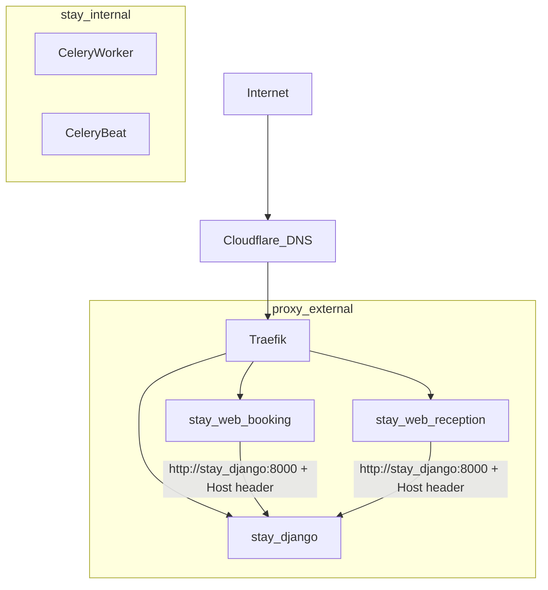

# Postavljanje domena (booking + recepcija)

Operativne upute za domene web frontenda Stay.hr platforme.

**Repo na serveru:** `/opt/stacks/stay.hr`  
**Deploy:** `git pull` + `./scripts/deploy.sh` (vidi [Deploy s GitHuba](#deploy-s-githuba))

---

## Tri sloja + internal mreža

| Sloj | Tko konfigurira | Što radi |
|------|-----------------|----------|
| **Cloudflare DNS** | Django backend (admin / management command) | A/CNAME zapisi, proxied → Hetzner IP |
| **Traefik** | `docker-compose.yml` labele (jednokratno + custom hostovi) | TLS (ACME DNS-01) + routing po `Host` |
| **Django `TenantDomain`** | Admin (`admin.stay.hr`) | Koji `Host` = koji tenant + property (booking kontekst) |
| **Docker `stay_internal`** | `docker-compose.yml` | Backend-to-backend (`stay_django:8000`) bez hairpin NAT-a |

Token **`CF_DNS_API_TOKEN`** — isti kao u `/opt/stacks/traefik/.env` (Traefik cert resolver + Django DNS upsert).

### Docker mreže



| Servis | `proxy` | `stay_internal` | `postgis` | `hetzner_net` |
|--------|---------|-----------------|-----------|---------------|
| `django` | da | da | da | da |
| `celery-worker` | ne | da | da | da |
| `celery-beat` | ne | da | da | da |
| `web-booking` | da | da | — | — |
| `web-reception` | da | da | — | — |

Web SSR/API proxy mora **prosljeđivati originalni `Host`** (npr. `booking.uzorita.hr`) da `TenantHostMiddleware` i `site-context` rade ispravno.

---

## Preduvjeti

1. Traefik stack na `/opt/stacks/traefik`, mreža `proxy`
2. Mreža `stay_internal` (compose je kreira automatski; ili `docker network create stay_internal`)
3. U Django `.env` na serveru ( `/opt/stacks/stay.hr/.env` ):

```env
CF_DNS_API_TOKEN=...          # Cloudflare API token (Zone DNS Edit)
STAY_SERVER_IP=...            # Javni IP Hetzner servera (proxied A record)
CLOUDFLARE_ZONE_STAY=stay.hr  # Zona za *.stay.hr subdomene
STAY_API_INTERNAL_URL=http://stay_django:8000
STAY_PUBLIC_API_URL=https://api.stay.hr
```

4. Web frontend containeri (`web/booking`, `web/reception`) deployani s Traefik labelama

Za legacy bootstrap `api.stay.hr` / `admin.stay.hr` i dalje je dostupna skripta `./scripts/cloudflare_dns_upsert.sh`.

---

## A) Jednokratno — platforma

Prije go-live web frontenda (recepcija + booking subdomene).

### 1. DNS (backend)

```bash
cd /opt/stacks/stay.hr
docker compose run --rm django python manage.py provision_platform_dns
```

Očekivani zapisi u zoni `stay.hr` (proxied A → `STAY_SERVER_IP`):

| Host | Namjena |
|------|---------|
| `app.stay.hr` | Recepcija u browseru |
| `*.stay.hr` | Wildcard — tenant booking subdomene (`uzorita.stay.hr`, …) |

API i admin (`api.stay.hr`, `admin.stay.hr`) već postoje — ne dirati osim provjere.

### 2. Traefik (docker-compose)

U `docker-compose.yml` web servisa — jednokratno (već u repou):

- `Host(\`app.stay.hr\`)` → `stay-web-reception` (prioritet 100)
- `HostRegexp(\`^[a-z0-9-]+\\.stay\\.hr$\`)` → `stay-web-booking` (prioritet 50)
- `tls.certresolver=cloudflare` na routerima
- Custom domene: eksplicitni `Host()` routeri (npr. `booking.uzorita.hr`)

Zatim:

```bash
docker compose up -d
```

### 3. Provjera

```bash
curl -sS -o /dev/null -w '%{http_code}\n' https://app.stay.hr/
curl -sS -o /dev/null -w '%{http_code}\n' https://uzorita.stay.hr/
```

Očekivano: `200` ili `307` (redirect), ne `404`/`502`.

---

## B) Nova Stay subdomena (`*.stay.hr`)

Primjer: `demo.stay.hr` za tenant `demo`.

Wildcard DNS i Traefik `HostRegexp` već pokrivaju routing — **nema novih Traefik labela**.

### Koraci

1. **Admin** → [Tenant domains](https://admin.stay.hr/admin/tenants/tenantdomain/) → **Add**:
   - `domain`: `demo.stay.hr`
   - `tenant`: demo
   - `property`: (opcionalno) FK na objekt — ako je postavljen, booking ide direktno na taj objekt
   - `domain_type`: `stay_subdomain`
   - `is_verified`: `False`

2. Odaberi red → admin akcija **Provision DNS** → backend upsert-a A zapis u Cloudflare

3. Provjera:

```bash
curl -sS -o /dev/null -w '%{http_code}\n' https://demo.stay.hr/
curl -sS -H "Host: demo.stay.hr" http://stay_django:8000/api/v1/public/site-context/
```

4. Postavi `is_verified=True` u adminu

### Slug u URL-u (više objekata po tenantu)

Ako `TenantDomain.property` **nije** postavljen (tenant hub):

- `https://demo.stay.hr/p/<property-slug>/` — booking za taj objekt
- Primjer: `https://uzorita.stay.hr/p/uzorita/`

---

## C) Custom domena (vanjski host)

Primjer: `booking.uzorita.hr` → tenant `uzorita`, property `uzorita`.

Wildcard `*.stay.hr` **ne pokriva** vanjsku domenu — treba i DNS i Traefik `Host()` rule.

### Koraci

1. **Admin** → TenantDomain → **Add**:
   - `domain`: `booking.uzorita.hr`
   - `tenant`: uzorita
   - `property`: Uzorita Luxury Rooms (`slug=uzorita`)
   - `domain_type`: `custom_domain`
   - `is_verified`: `False`

2. Admin akcija **Provision DNS**  
   Backend upsert-a zapis u zoni `uzorita.hr` (mora biti u istom Cloudflare accountu kao token).

3. **Traefik** — label u `docker-compose.yml` booking servisa (Uzorita MVP):

```yaml
- traefik.http.routers.stay-booking-uzorita.rule=Host(`booking.uzorita.hr`)
- traefik.http.routers.stay-booking-uzorita.entrypoints=websecure
- traefik.http.routers.stay-booking-uzorita.tls=true
- traefik.http.routers.stay-booking-uzorita.tls.certresolver=cloudflare
- traefik.http.routers.stay-booking-uzorita.service=stay-web-booking
```

```bash
cd /opt/stacks/stay.hr
docker compose up -d
```

4. Provjera:

```bash
curl -sS -o /dev/null -w '%{http_code}\n' https://booking.uzorita.hr/
curl -sS -H "Host: booking.uzorita.hr" http://stay_django:8000/api/v1/public/site-context/
```

5. `is_verified=True` u adminu

---

## D) Recepcija (`app.stay.hr`)

- Fiksna platform domena — **ne ovisi** o property slug-u
- Nema javnog bookiranja; auth = device token (kao Hospira tablet)
- DNS: uključen u `provision_platform_dns`
- Traefik: `Host(\`app.stay.hr\`)` → reception container

---

## E) Uzorita go-live (automatski rollout)

Management command za seed + DNS + provjere:

```bash
cd /opt/stacks/stay.hr
docker compose run --rm django python manage.py rollout_uzorita_domains
```

Command:

1. Upsert-a `TenantDomain` zapise (`uzorita.stay.hr`, `booking.uzorita.hr`)
2. Pokreće `provision_platform_dns` + **Provision DNS** po domenu
3. Curl provjere (javni hostovi + internal `site-context`)
4. Postavlja `is_verified=True` ako sve prođe

Opcije: `--skip-dns`, `--skip-verify`, `--dry-run`.

---

## Deploy s GitHuba

Na Hetzner serveru (SSH):

```bash
cd /opt/stacks/stay.hr
git pull
./scripts/deploy.sh
```

`deploy.sh` rebuild-a image ako ima novih migracija; inače restart servisa.

**Ova uputa** (`docs/operations/domain-setup.md`) dolazi na server automatski s `git pull` — nema zasebnog koraka.

### Redoslijed pri prvom web go-live

1. `git pull` + `./scripts/deploy.sh` (backend + mreže + web imagei)
2. `provision_platform_dns` (jednokratno)
3. `docker compose up -d` (web servisi + Traefik labele)
4. Admin: TenantDomain zapisi + **Provision DNS** po objektu (ili `rollout_uzorita_domains`)
5. Traefik `Host()` labele za custom domene izvan `*.stay.hr` (Uzorita već u compose-u)
6. Provjera curl + `is_verified=True`

---

## Checklist — Uzorita

| # | Korak | OK |
|---|--------|-----|
| 1 | `provision_platform_dns` (app + wildcard) | |
| 2 | Traefik labele: `app.stay.hr`, `HostRegexp *.stay.hr` | |
| 3 | TenantDomain `uzorita.stay.hr` (tenant hub, property=null) + Provision DNS | |
| 4 | TenantDomain `booking.uzorita.hr` (property=uzorita) + Provision DNS | |
| 5 | Traefik `Host(booking.uzorita.hr)` | |
| 6 | `https://booking.uzorita.hr/` radi | |
| 7 | `https://uzorita.stay.hr/p/uzorita/` radi | |
| 8 | `https://app.stay.hr/` recepcija | |

---

## Troubleshooting

| Simptom | Provjeri |
|---------|----------|
| `502 Bad Gateway` | Je li web container up? `docker compose ps` |
| DNS ne resolve | Cloudflare dashboard → DNS zapisi; `Provision DNS` ponovno |
| TLS greška | Traefik log; `CF_DNS_API_TOKEN` u traefik `.env`; DNS mora biti proxied |
| Booking prikazuje krivi objekt | `TenantDomain.property` FK; `site-context` s `Host` headerom |
| `404` na custom domeni | Nedostaje Traefik `Host()` label za tu domenu |
| Admin `is_verified` blokira | U produkciji middleware filtrira neverified domene — postavi verified nakon provjere |
| Web ne vidi tenant | Prosljeđuje li edge `Host` header na `STAY_API_INTERNAL_URL`? |

---

## Što backend ne automatizira (MVP)

- **Traefik router labele** — ručno u `docker-compose.yml` (custom domene izvan wildcarda)
- **TLS certifikati** — Traefik ACME automatski nakon DNS-a
- **Cloudflare WAF / Page Rules** — po potrebi u CF dashboardu

---

## Povezani dokumenti

- [README — Cloudflare DNS](../../README.md#cloudflare-dns-api--admin)
- [README — Traefik / tenant subdomains](../../README.md#traefik--tenant-subdomains-later)
- `scripts/cloudflare_dns_upsert.sh` — legacy bootstrap za api/admin hostove
