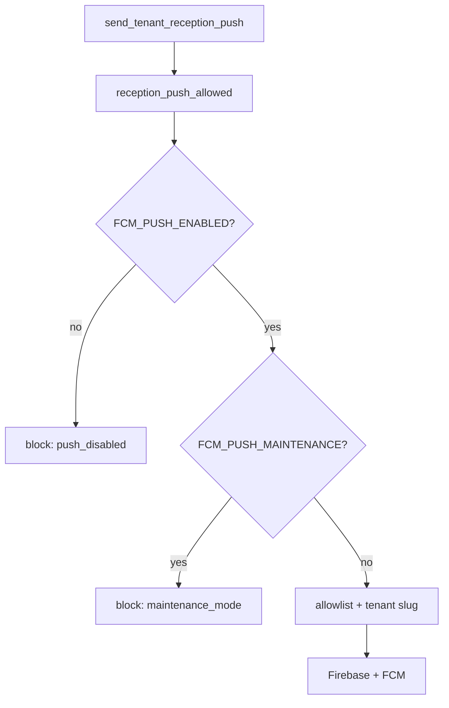

# FCM push guard — operativni runbook

Centralni filter za push obavijesti na Hospira reception tablete. Kod: `backend/apps/core/notifications.py` (`reception_push_allowed`, `send_tenant_reception_push`).

**Produkcija (2026-07-04):** maintenance mode (v2) deployan; allowlist `demo,uzorita,channex`, `FCM_PUSH_MAINTENANCE=false`.

---

## Tri sloja odlučivanja

| Postavka | Značenje | Kad mijenjati |
|----------|----------|---------------|
| `FCM_PUSH_ENABLED` | FCM aktivan u ovoj instalaciji | Rijetko; testovi ga drže `false` |
| `FCM_PUSH_MAINTENANCE` | Privremeno utišava isporuku | Deploy, import, seed, bulk migracije |
| `FCM_PUSH_ALLOWED_TENANT_SLUGS` | Koji tenanti smiju primati push u normalnom radu | Onboarding novog tenanta |



**Ne koristiti** sužavanje allowliste ili gašenje `FCM_PUSH_ENABLED` za rutinsko održavanje — za to služi `FCM_PUSH_MAINTENANCE`.

---

## `.env` (produkcija)

```env
FCM_PUSH_ENABLED=true
FCM_PUSH_MAINTENANCE=false
FCM_PUSH_ALLOWED_TENANT_SLUGS=demo,uzorita,channex
FIREBASE_SERVICE_ACCOUNT_PATH=/run/secrets/firebase-service-account.json
FIREBASE_PROJECT_ID=hospira-fc0dc
```

Primjer u repou: [`.env.example`](../../.env.example).

---

## Maintenance workflow

### Prije deploya, importa ili seeda

1. U `.env` postavi `FCM_PUSH_MAINTENANCE=true`
2. Recreate kontejnere (env se ne osvježava na `restart`):

```bash
docker compose up -d django celery-worker
```

### Nakon završetka

1. Vrati `FCM_PUSH_MAINTENANCE=false`
2. Ponovo:

```bash
docker compose up -d django celery-worker
```

Tijekom maintenancea u logovima očekuj `reason=maintenance_mode`, ne `tenant_not_allowed`.

---

## Deploy koda + konfiguracije

```bash
cd /opt/stacks/stay.hr
git pull
./scripts/deploy.sh
```

Ako je mijenjan samo `.env` (bez novog koda), dovoljno je:

```bash
docker compose up -d django celery-worker celery-beat
```

**Ne koristiti** `docker compose restart` za promjene `.env` — kontejner zadržava stari env.

Backend rebuild (nakon izmjena u `backend/`):

```bash
docker compose build django celery-worker celery-beat
docker compose up -d django celery-worker celery-beat
```

---

## Smoke test nakon deploya

### 1. Provjera postavki u kontejneru

```bash
docker compose exec django python manage.py shell -c "
from django.conf import settings
print('MAINTENANCE', settings.FCM_PUSH_MAINTENANCE)
print('ALLOWLIST', settings.FCM_PUSH_ALLOWED_TENANT_SLUGS)
"
```

Isto za `celery-worker` — oba servisa moraju imati iste vrijednosti.

### 2. Guard po tenantu

```bash
docker compose exec django python manage.py shell -c "
from apps.core.notifications import reception_push_allowed
from apps.tenants.models import Tenant
for slug in ('demo', 'uzorita', 'channex'):
    t = Tenant.objects.filter(slug=slug).first()
    if t:
        d = reception_push_allowed(tenant_id=t.pk)
        print(slug, d.allowed, d.block_reason)
"
```

U normalnom radu: svi `allowed=True`, `block_reason=None`.

### 3. Maintenance toggle (kratko)

1. `FCM_PUSH_MAINTENANCE=true` → `docker compose up -d django celery-worker`
2. Pokreni akciju koja bi inače poslala push (npr. nova rezervacija na `demo`)
3. U logovima: `Skipping push ... reason=maintenance_mode` — bez FCM HTTP poziva
4. Vrati `FCM_PUSH_MAINTENANCE=false` → `up -d` ponovo

---

## Log `reason=` vrijednosti

| `block_reason` | Uzrok |
|----------------|--------|
| `push_disabled` | `FCM_PUSH_ENABLED=false` |
| `maintenance_mode` | `FCM_PUSH_MAINTENANCE=true` |
| `allowlist_empty` | Prazna allowlista (fail-closed) |
| `tenant_not_found` | Nepostojeći `tenant_id` |
| `tenant_not_allowed` | Tenant nije u allowlisti |

Nakon guarda, caller može preskočiti i bez `block_reason`: Firebase nije konfiguriran, nema FCM tokena, ili FCM send exception.

---

## Testovi

```bash
docker compose build django
docker compose exec django python manage.py test \
  apps.core.tests.test_notifications.ReceptionPushAllowedTests \
  apps.core.tests.test_notifications.SendTenantReceptionPushGuardTests \
  --settings=config.settings.test_postgis --noinput -v 2
```

Test settings (`config.settings.test`, `test_postgis`) postavljaju `FCM_PUSH_ENABLED=false` — push se ne šalje tijekom test suitea.

Detalji: [test-suite.md](../development/test-suite.md).

---

## Out of scope (v2)

Sljedeće se ne dodaje dok ne postoji stvarna potreba:

- `--no-notify` na management naredbama
- `Tenant.push_enabled` u bazi
- promjene signala / Celery taskova / webhookova
